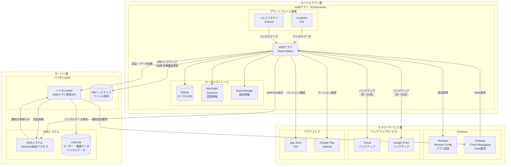

# HDBシステム構成図

## 全体システム構成

```mermaid
graph TB
    subgraph "モバイルアプリ層"
        subgraph "HDBアプリ（iOS/Android）"
            APP[HDBアプリ<br/>React Native]
            
            subgraph "ローカルストレージ"
                SQLITE[(SQLite<br/>ローカルDB)]
                KEYCHAIN[Keychain/<br/>Keystore<br/>認証情報]
                ASYNC[AsyncStorage<br/>設定情報]
            end
            
            subgraph "プラットフォーム連携"
                HEALTHKIT[HealthKit<br/>iOS]
                HEALTHCONNECT[ヘルスコネクト<br/>Android]
            end
        end
    end
    
    subgraph "サーバー層"
        subgraph "バイタルAWS"
            AWS[バイタルAWS<br/>HDBアプリ専用API]
            AWS_BACKUP[(DBバックアップ<br/>ファイル保存)]
        end
        
        subgraph "HDBシステム"
            HDB[HDBシステム<br/>WebView経由アクセス]
            HDB_DB[(HDB DB<br/>ユーザー・健康データ<br/>バイタルデータ)]
        end
    end
    
    subgraph "クラウドサービス層"
        subgraph "Firebase"
            FIREBASE_CONFIG[Firebase<br/>Remote Config<br/>アプリ設定]
            FCM[Firebase<br/>Cloud Messaging<br/>Push通知]
        end
        
        subgraph "バックアップサービス"
            ICLOUD[iCloud<br/>バックアップ]
            GDRIVE[Google Drive<br/>バックアップ]
        end
        
        subgraph "アプリストア"
            APPSTORE[App Store<br/>iOS]
            PLAYSTORE[Google Play<br/>Android]
        end
    end
    
    %% アプリ⇔サーバー通信
    APP -->|認証・データ同期| AWS
    APP -->|DBバックアップ<br/>OS跨ぎ機種変更用| AWS_BACKUP
    APP -->|WebView表示| HDB
    AWS -->|認証連携| HDB
    AWS -->|バイタルデータ保存| HDB_DB
    
    %% アプリ⇔クラウドサービス通信
    APP -->|設定取得| FIREBASE_CONFIG
    FCM -->|Push通知| APP
    APP -->|バックアップ<br/>同一OS内| ICLOUD
    APP -->|バックアップ<br/>同一OS内| GDRIVE
    APP -->|バージョン確認| APPSTORE
    APP -->|バージョン確認| PLAYSTORE
    
    %% アプリ⇔プラットフォーム連携
    HEALTHKIT -->|バイタルデータ| APP
    HEALTHCONNECT -->|バイタルデータ| APP
    
    %% アプリ内データフロー
    APP --> SQLITE
    APP --> KEYCHAIN
    APP --> ASYNC
    
    %% サーバー間通信
    HDB -->|通知対象者CSV| AWS
    AWS -->|通知送信要求| FCM
```