# 画面別API通信図

### 外部システム一覧
- **バイタルAWS**: HDBアプリ専用のバックエンドAPI
- **HDB**: 既存のHDBシステム（WebView経由でアクセス）
- **Firebase Remote Config**: アプリ設定の動的管理
- **Firebase Cloud Messaging (FCM)**: Push通知配信
- **HealthKit/ヘルスコネクト**: 端末のヘルスデータ取得
- **Keychain/Keystore**: セキュアなトークン保存
- **AsyncStorage**: アプリ設定の永続化
- **iCloud/Google Drive**: バックアップデータ保存

## 1. スプラッシュ画面

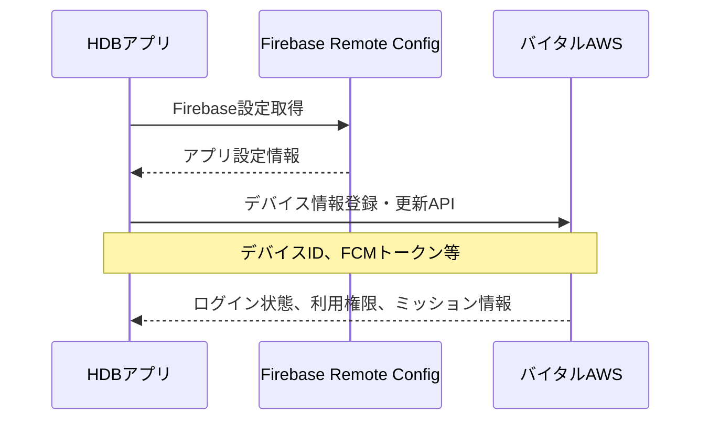

## 2. ログイン画面

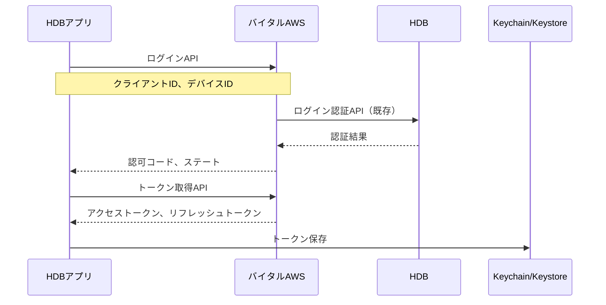

## 3. トップメニュー（ダッシュボード）

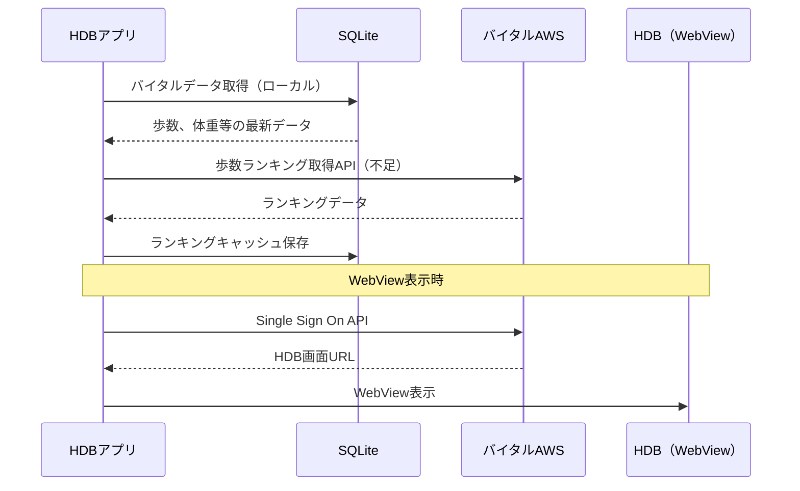

## 4. バイタルデータ表示画面

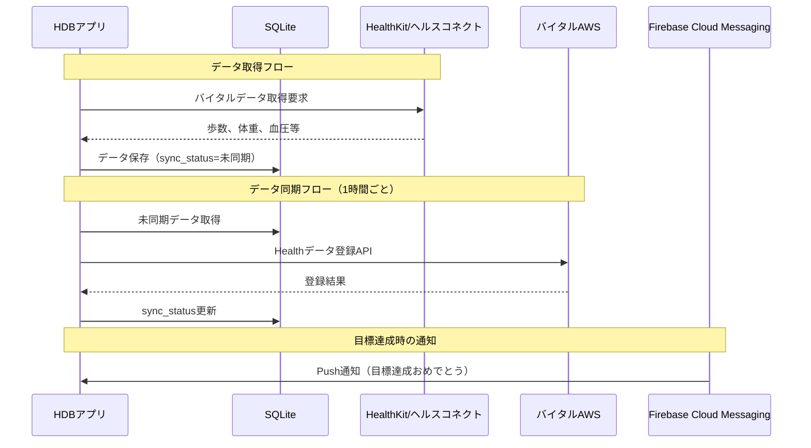

## 5. バイタル入力ダイアログ

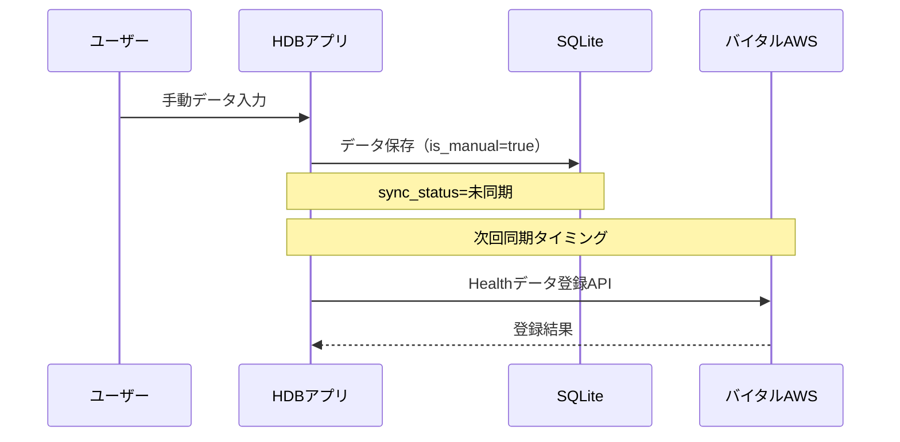

## 6. マイページ画面

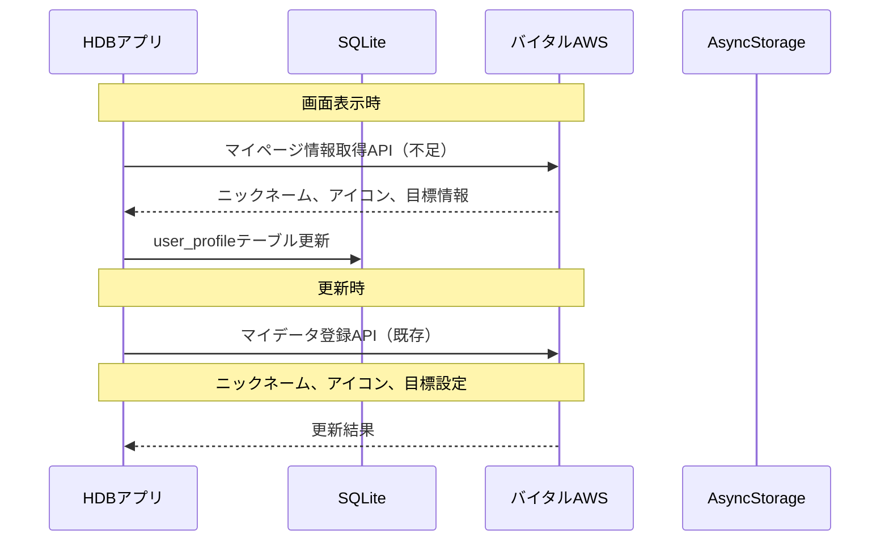

## 7. ミッション画面

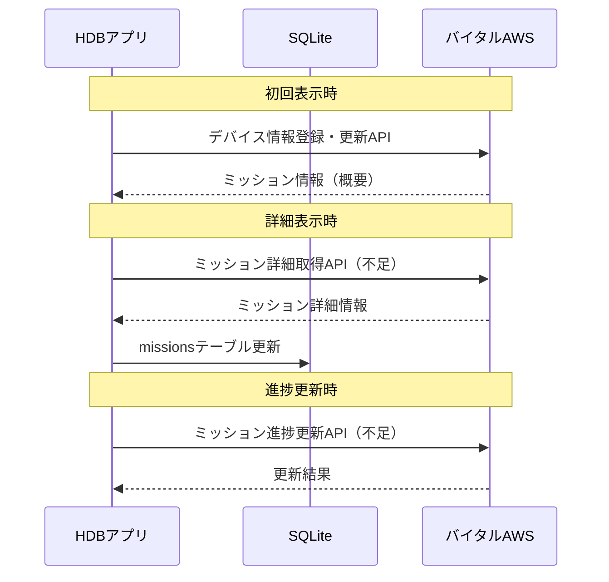

## 8. 通知設定画面

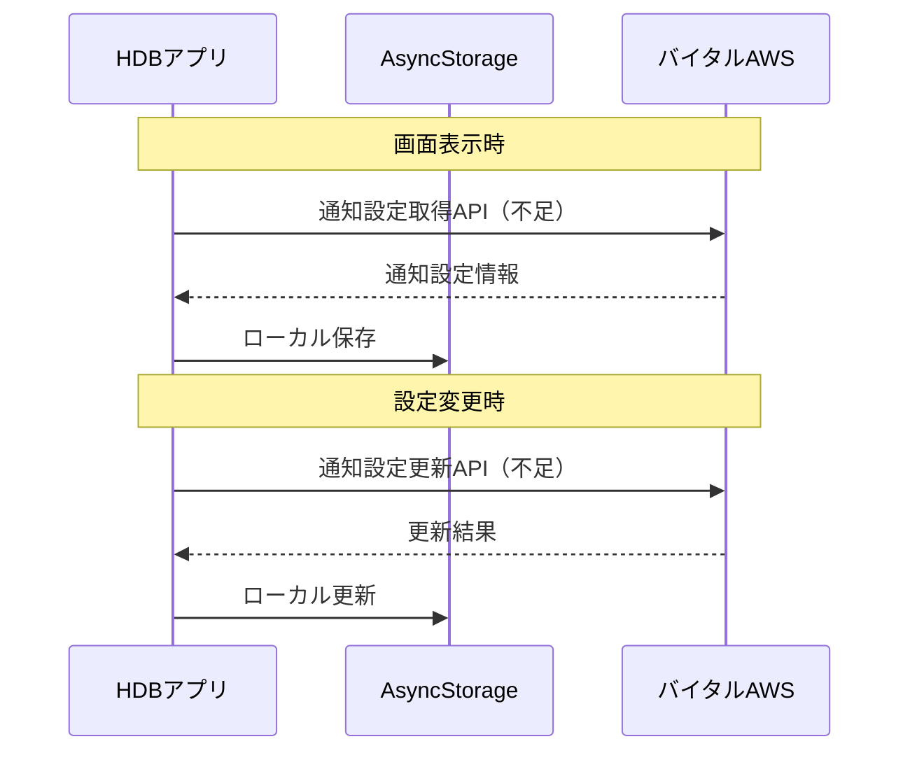

## 9. 連携サービス画面

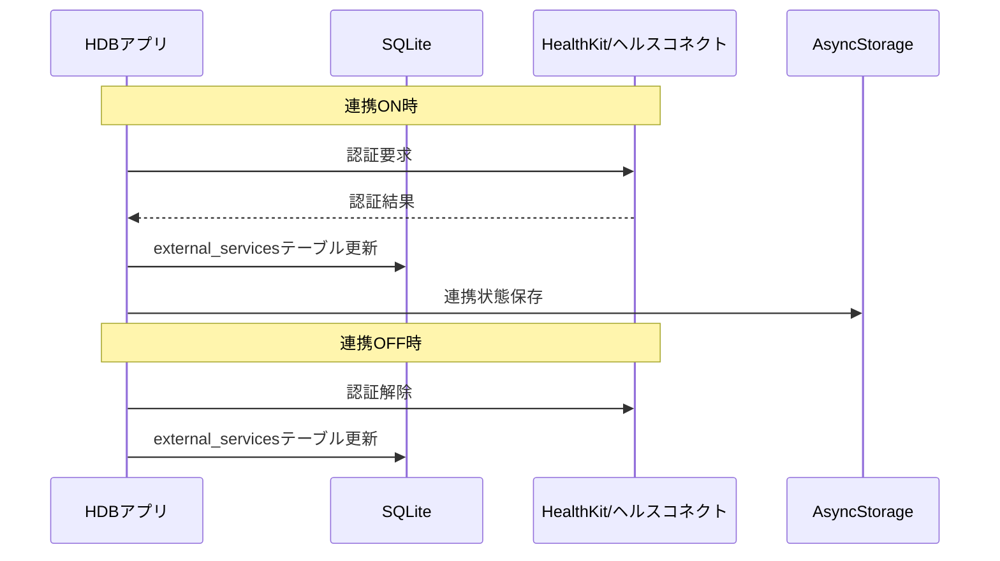

## 10. お知らせ画面

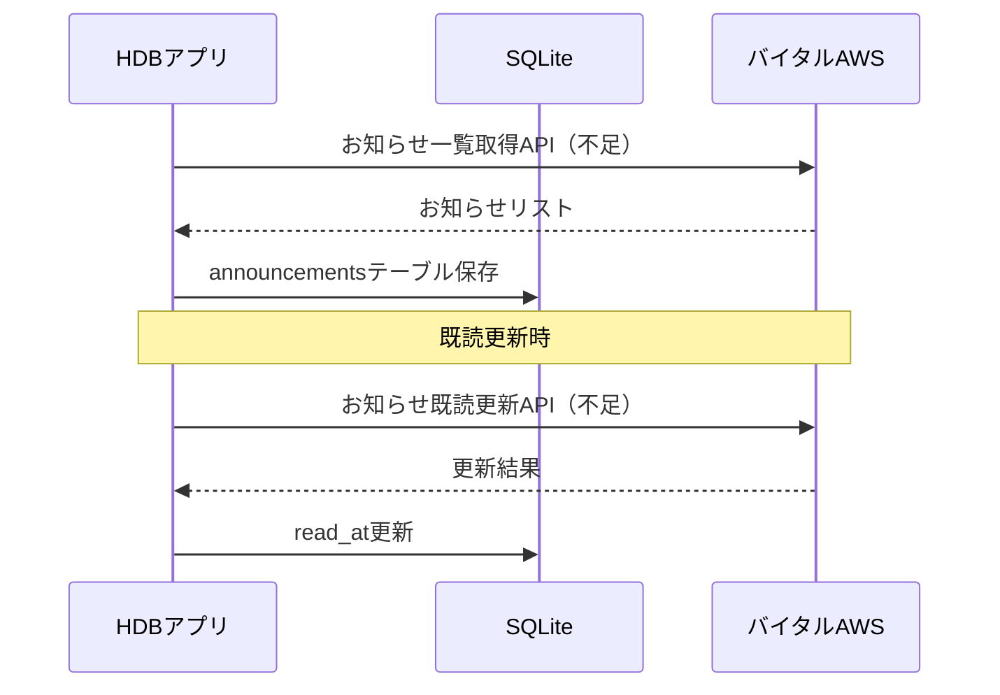

## 11. DBバックアップ・リストア画面

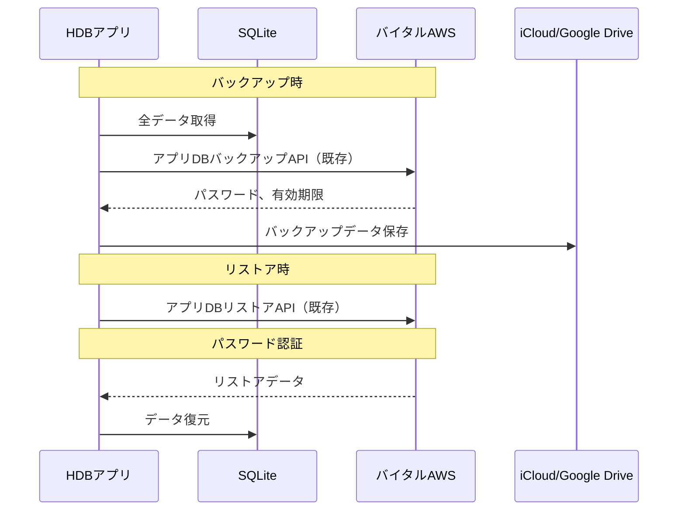

## 12. 転籍データ移行画面

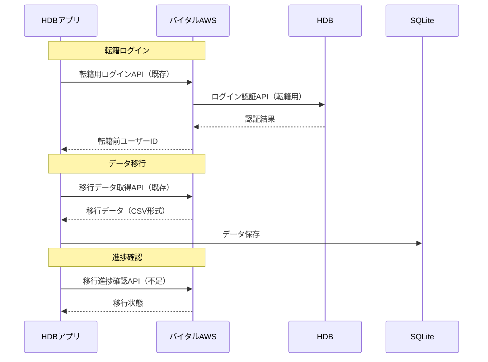

## 13. Push通知受信フロー

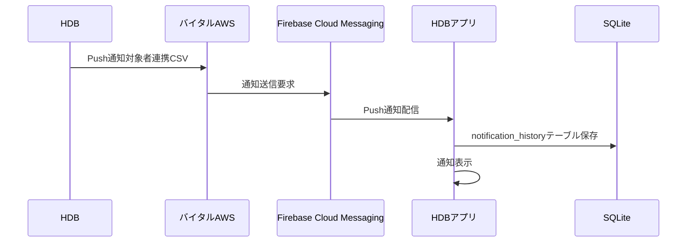

## API通信の特徴

1. **バイタルデータ**
   - 取得：HealthKit/ヘルスコネクト → アプリ内DB
   - 送信：アプリ内DB → バイタルAWS（Healthデータ登録API）
   - サーバーからの取得は不要（アプリ内DBで完結）

2. **認証・セキュリティ**
   - トークンはKeychain/Keystoreに保存
   - WebView表示時はSingle Sign On APIを使用

3. **同期管理**
   - sync_statusフラグで未同期データを管理
   - 1時間ごとにバッチ同期

4. **キャッシュ戦略**
   - ランキングデータはローカルキャッシュ
   - 通知設定はAsyncStorageに保存

5. **不足しているAPI**
   - 各種取得系API（マイページ、ミッション、通知設定、お知らせ、ランキング）
   - 更新系API（ミッション進捗、通知設定、お知らせ既読）
   - 状態確認API（認証状態、移行進捗）