# 画面別API通信図

### 外部システム一覧
- **バイタルAWS**: HDBアプリ専用のバックエンドAPI
- **HDB**: 既存のHDBシステム（WebView経由でアクセス）
- **Firebase Remote Config**: アプリ設定の動的管理
- **Firebase Cloud Messaging (FCM)**: Push通知配信
- **HealthKit/ヘルスコネクト**: 端末のヘルスデータ取得
- **Keychain/Keystore**: セキュアなトークン保存
- **AsyncStorage**: アプリ設定の永続化
- **iCloud/Google Drive**: バックアップデータ保存
- **App Store/Google Play**: アプリアップデート
- **iTunes Search API**: App Storeの最新バージョン情報取得（iOS）
- **Google Play In-app updates API / Developer API**: Play Storeの最新バージョン情報取得（Android）

## 1. スプラッシュ画面

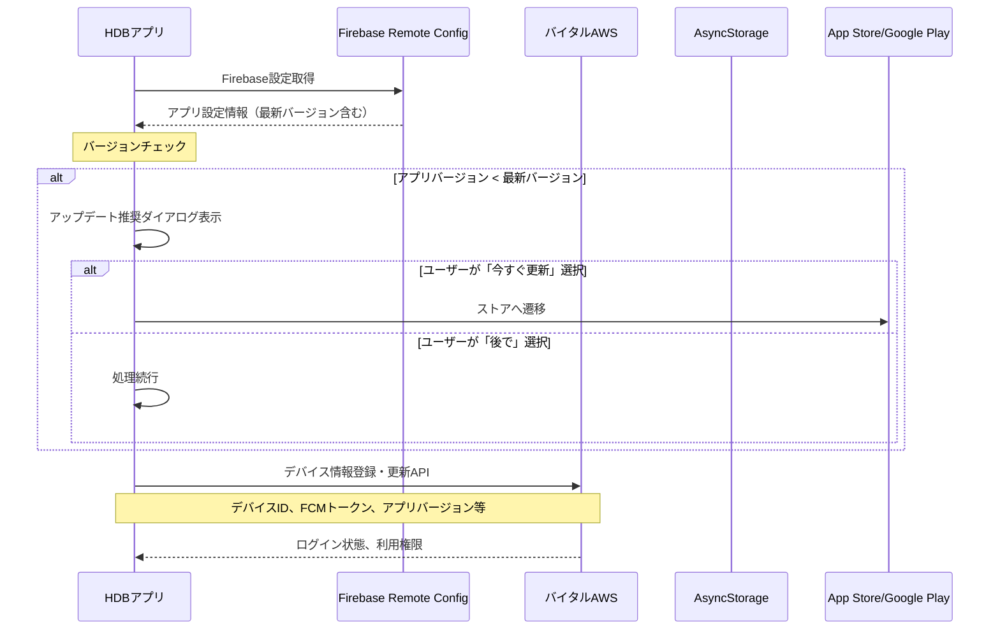

## 2. ログイン画面

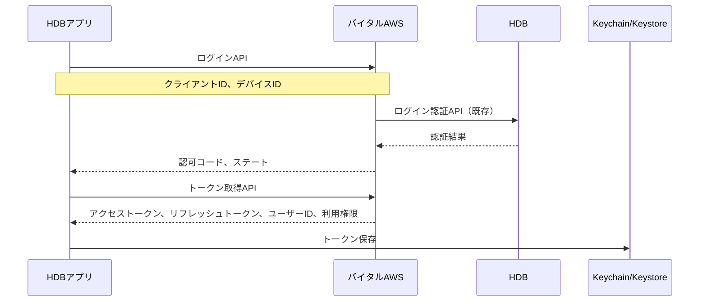

## 3. トップメニュー（目標画面）

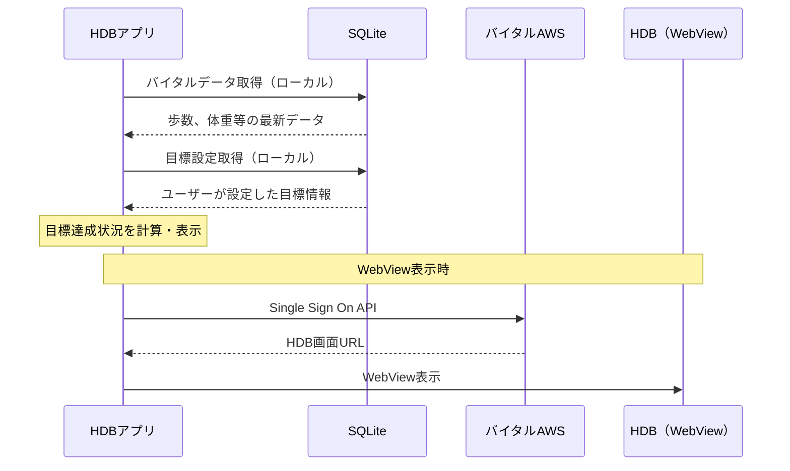

## 4. バイタルデータ表示画面

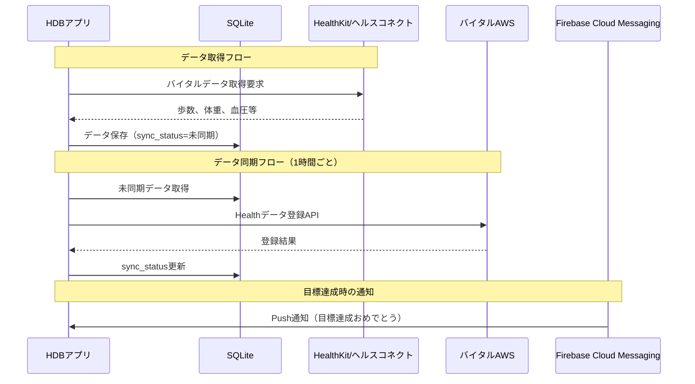

## 5. バイタル入力ダイアログ

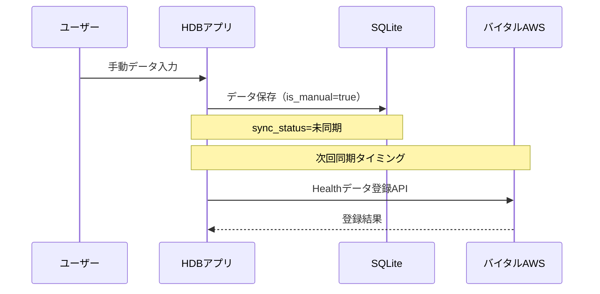

## 6. マイページ画面

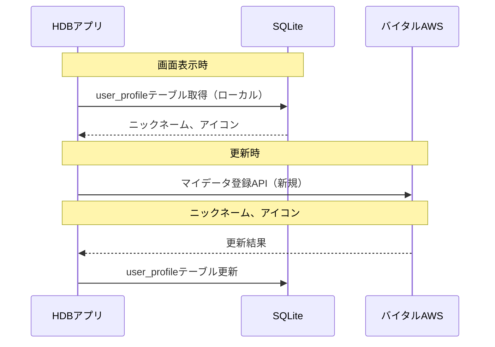

## 7. 目標設定画面

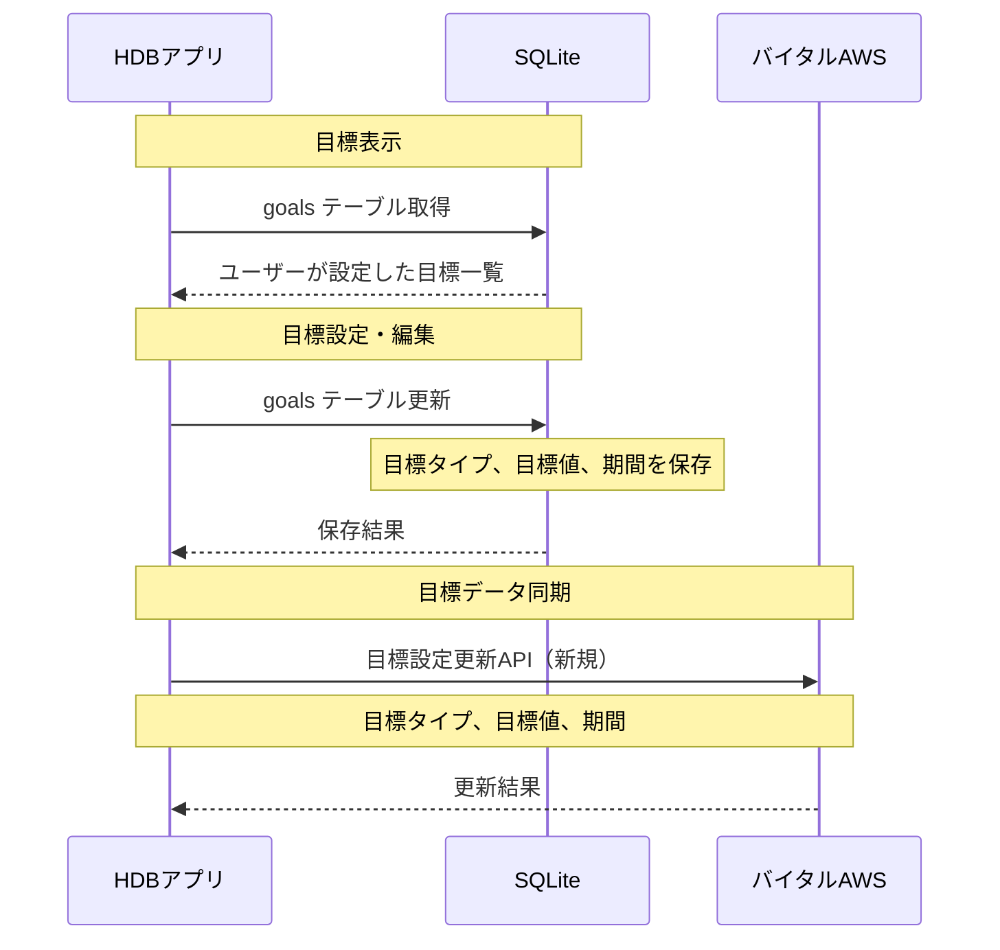

## 8. 通知設定画面

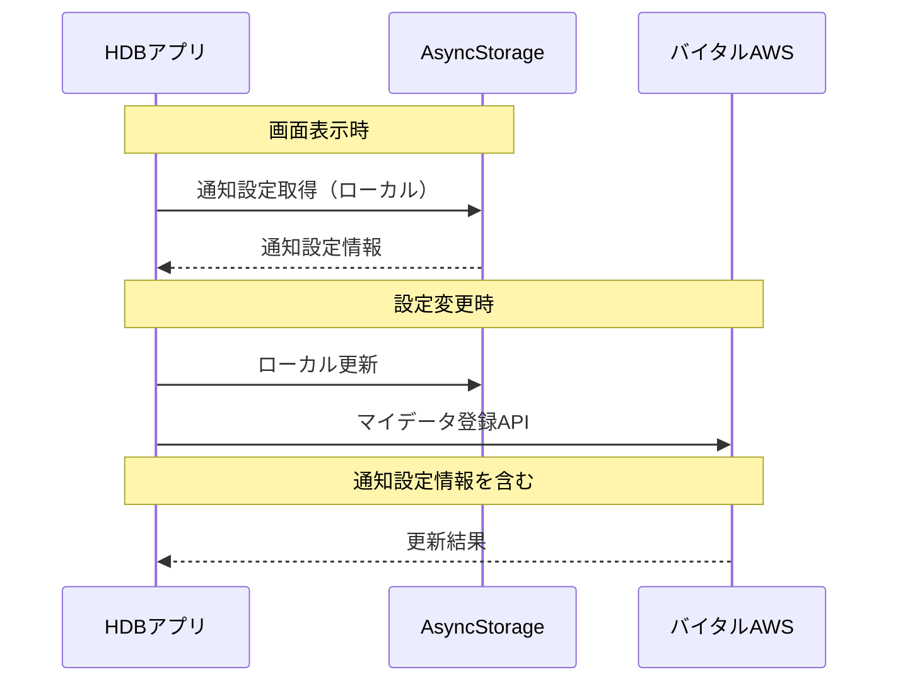

## 9. 連携サービス画面

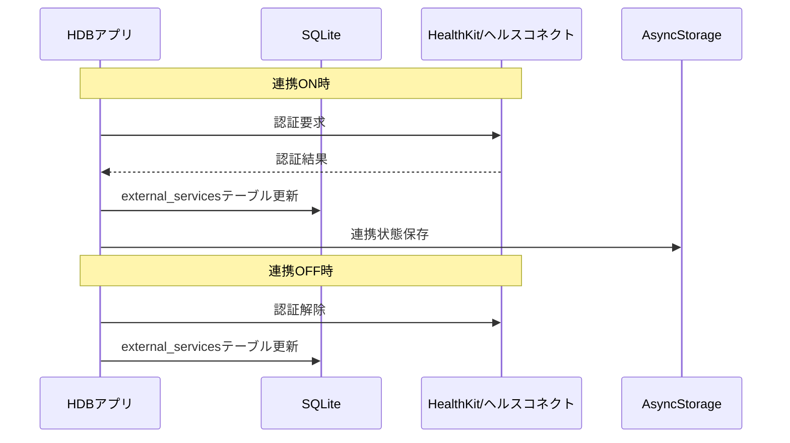

## 10. お知らせ画面

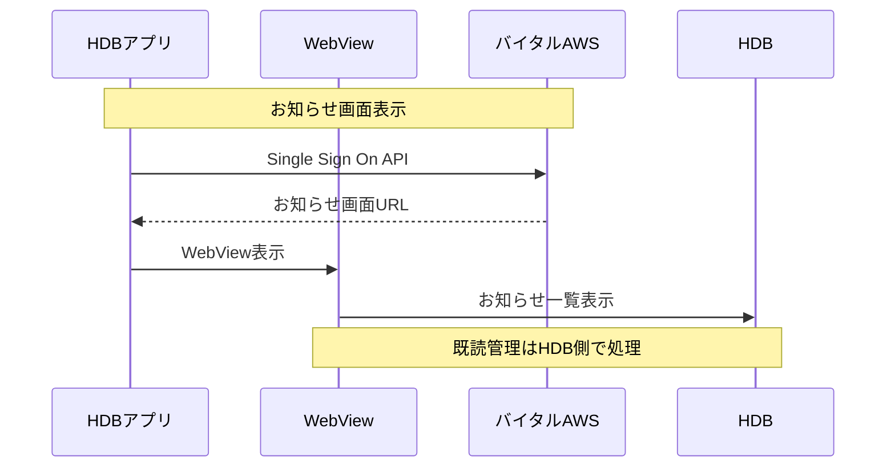

## 11. DBバックアップ・リストア画面

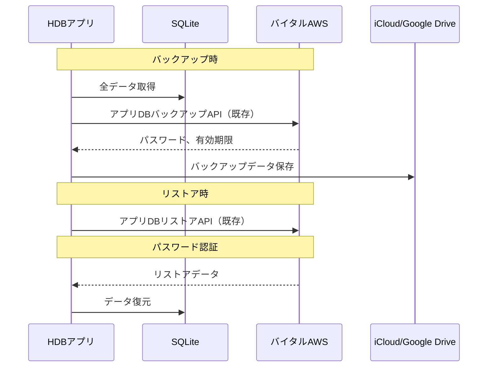

## 12. 転籍データ移行画面

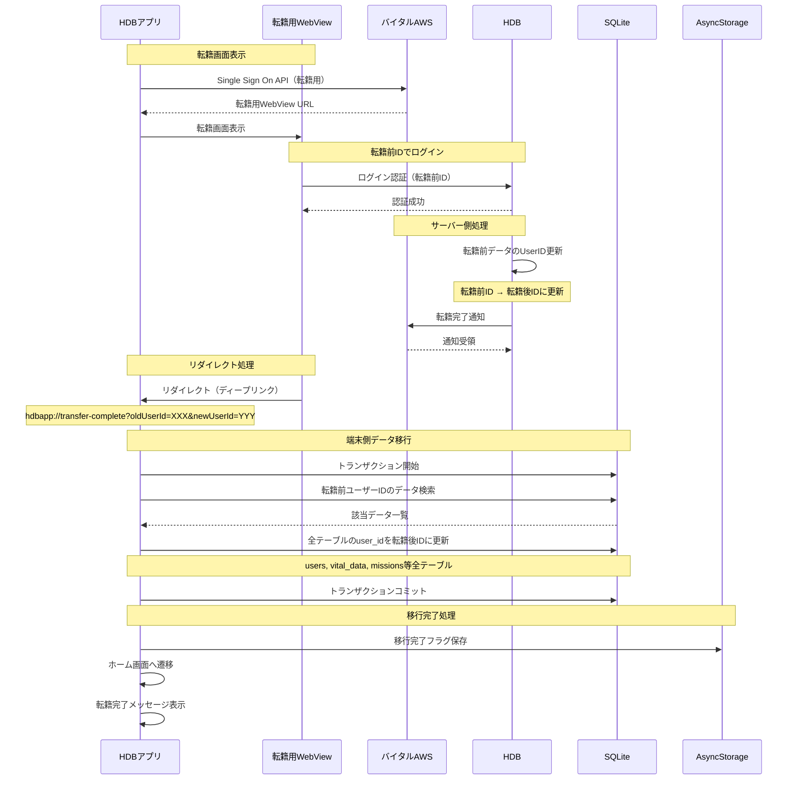

## 13. Push通知受信フロー

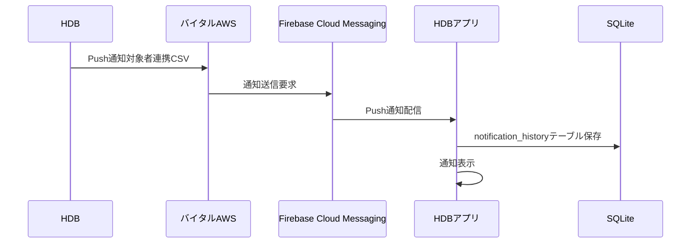

## 14. アプリバージョンチェックフロー

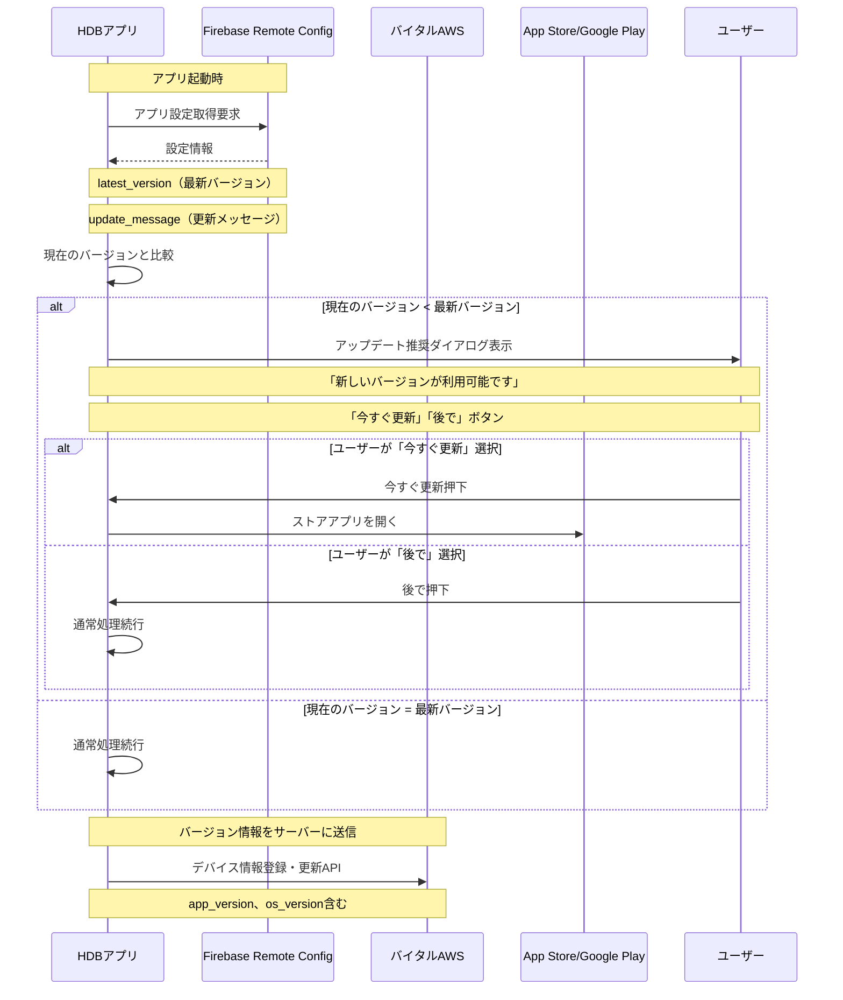

## API関連のポイント

1. **バイタルデータ**
   - 取得：HealthKit/ヘルスコネクト → アプリ内DB
   - 送信：アプリ内DB → バイタルAWS（Healthデータ登録API）
   - サーバーからの取得は不要（アプリ内DBで完結）

2. **認証・セキュリティ**
   - トークンはKeychain/Keystoreに保存
   - WebView表示時はSingle Sign On APIを使用

3. **同期管理**
   - sync_statusフラグで未同期データを管理
   - 1時間ごとにバッチ同期

4. **キャッシュ戦略**
   - ランキングデータはローカルキャッシュ
   - 通知設定はAsyncStorageに保存

5. **バージョン管理**
   - Firebase Remote Config経由で最新バージョンを管理
   - メリット: 柔軟な制御、カスタムメッセージ設定可能
   - デメリット: 手動更新が必要
   - アップデート推奨：最新バージョン未満の場合、更新を推奨（スキップ可能）
   - 常に最新バージョンを保つように促す

6. **不足しているAPI**
   - 更新系API（目標設定）
   - 移行完了通知API（転籍処理）

## 転籍処理の重要ポイント

### 処理フロー
1. **転籍用WebView表示**
   - アプリからSingle Sign On APIで転籍用URLを取得
   - WebView内で転籍前のIDでログイン

2. **サーバー側処理**
   - HDBサーバーで転籍前データのUserIDを転籍後UserIDに更新
   - 更新完了後、転籍完了通知をバイタルAWSへ送信

3. **端末側処理**
   - WebViewからのリダイレクト（ディープリンク）でアプリ側に通知
   - リダイレクトURL例：`hdbapp://transfer-complete?oldUserId=XXX&newUserId=YYY`
   - アプリ内DBの全テーブルのuser_idを一括更新（トランザクション処理）

### 実装上の注意点
- **ディープリンク設定**：iOS/Androidでのカスタムスキーム（hdbapp://）の設定が必要
- **トランザクション処理**：データ整合性を保つため、全テーブルの更新は単一トランザクション内で実行
- **エラーハンドリング**：転籍処理中のエラーに対する適切なリカバリー処理
- **状態管理**：転籍完了フラグをAsyncStorageに保存し、重複処理を防止

### 更新対象テーブル
- users
- vital_data
- missions
- events
- notifications
- linked_services
- その他user_idカラムを持つ全テーブル