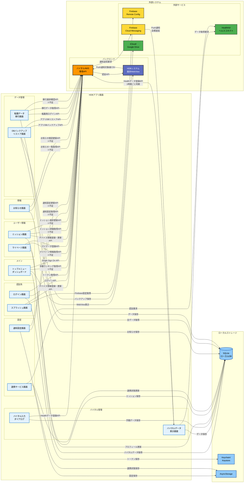

# HDBアプリ通信構成図

## 画面別通信構成図

```mermaid
graph LR
    %% 左側：アプリ画面（縦に配置）
    subgraph "HDBアプリ画面"
        subgraph "認証系"
            SPLASH[スプラッシュ画面]
            LOGIN[ログイン画面]
        end

        subgraph "メイン"
            DASHBOARD[トップメニュー<br/>ダッシュボード]
        end

        subgraph "バイタル管理"
            VITAL_DISPLAY[バイタルデータ<br/>表示画面]
            VITAL_INPUT[バイタル入力<br/>ダイアログ]
        end

        subgraph "ユーザー情報"
            MYPAGE[マイページ画面]
            MISSION[ミッション画面]
        end

        subgraph "設定"
            NOTIFICATION[通知設定画面]
            SERVICE[連携サービス画面]
        end

        subgraph "情報"
            ANNOUNCE[お知らせ画面]
        end

        subgraph "データ管理"
            BACKUP[DBバックアップ<br/>リストア画面]
            TRANSFER[転籍データ<br/>移行画面]
        end
    end

    %% 中央：ローカルストレージ
    subgraph "ローカルストレージ"
        SQLITE[(SQLite<br/>ローカルDB)]
        KEYCHAIN[Keychain/<br/>Keystore]
        ASYNC[AsyncStorage]
    end

    %% 右側：外部システム
    subgraph "外部システム"
        subgraph "バックエンド"
            AWS[バイタルAWS<br/>専用API]
            HDB[HDBシステム<br/>既存WebView]
        end

        subgraph "外部サービス"
            FIREBASE[Firebase<br/>Remote Config]
            FCM[Firebase<br/>Cloud Messaging]
            HEALTH[HealthKit/<br/>ヘルスコネクト]
            CLOUD[iCloud/<br/>Google Drive]
        end
    end

    %% スプラッシュ画面の通信
    SPLASH -->|Firebase設定取得| FIREBASE
    SPLASH -->|デバイス情報登録・更新API| AWS

    %% ログイン画面の通信
    LOGIN -->|ログインAPI| AWS
    LOGIN -->|トークン取得API| AWS
    LOGIN -->|トークン保存| KEYCHAIN
    AWS -->|認証API| HDB

    %% ダッシュボード画面の通信
    DASHBOARD -->|バイタルデータ取得| SQLITE
    DASHBOARD -->|歩数ランキング取得API<br/>※不足| AWS
    DASHBOARD -->|Single Sign On API| AWS
    DASHBOARD -->|WebView表示| HDB

    %% バイタルデータ表示画面の通信
    VITAL_DISPLAY -->|データ取得要求| HEALTH
    VITAL_DISPLAY -->|データ保存| SQLITE
    VITAL_DISPLAY -->|Healthデータ登録API<br/>1時間ごと同期| AWS
    FCM -->|Push通知<br/>目標達成| VITAL_DISPLAY

    %% バイタル入力ダイアログの通信
    VITAL_INPUT -->|手動データ保存| SQLITE
    VITAL_INPUT -->|Healthデータ登録API| AWS

    %% マイページ画面の通信
    MYPAGE -->|マイページ情報取得API<br/>※不足| AWS
    MYPAGE -->|マイデータ登録API| AWS
    MYPAGE -->|プロフィール更新| SQLITE

    %% ミッション画面の通信
    MISSION -->|デバイス情報登録・更新API| AWS
    MISSION -->|ミッション詳細取得API<br/>※不足| AWS
    MISSION -->|ミッション進捗更新API<br/>※不足| AWS
    MISSION -->|ミッション保存| SQLITE

    %% 通知設定画面の通信
    NOTIFICATION -->|通知設定取得API<br/>※不足| AWS
    NOTIFICATION -->|通知設定更新API<br/>※不足| AWS
    NOTIFICATION -->|設定保存| ASYNC

    %% 連携サービス画面の通信
    SERVICE -->|認証要求| HEALTH
    SERVICE -->|連携状態更新| SQLITE
    SERVICE -->|連携状態保存| ASYNC

    %% お知らせ画面の通信
    ANNOUNCE -->|お知らせ一覧取得API<br/>※不足| AWS
    ANNOUNCE -->|お知らせ既読更新API<br/>※不足| AWS
    ANNOUNCE -->|お知らせ保存| SQLITE

    %% バックアップ・リストア画面の通信
    BACKUP -->|全データ取得| SQLITE
    BACKUP -->|アプリDBバックアップAPI| AWS
    BACKUP -->|アプリDBリストアAPI| AWS
    BACKUP -->|バックアップ保存| CLOUD

    %% 転籍データ移行画面の通信
    TRANSFER -->|転籍用ログインAPI| AWS
    TRANSFER -->|移行データ取得API| AWS
    TRANSFER -->|移行進捗確認API<br/>※不足| AWS
    TRANSFER -->|データ保存| SQLITE

    %% Push通知フロー
    HDB -->|Push通知対象者CSV| AWS
    AWS -->|通知送信要求| FCM

    %% スタイル設定
    classDef screenStyle fill:#E3F2FD,stroke:#1976D2,stroke-width:2px,color:#000
    classDef storageStyle fill:#90CAF9,stroke:#0D47A1,stroke-width:2px,color:#000
    classDef backendStyle fill:#FF9500,stroke:#333,stroke-width:3px,color:#000
    classDef hdbStyle fill:#5C6BC0,stroke:#333,stroke-width:3px,color:#fff
    classDef firebaseStyle fill:#FDD835,stroke:#333,stroke-width:2px,color:#000
    classDef healthStyle fill:#4CAF50,stroke:#333,stroke-width:2px,color:#000
    
    class SPLASH,LOGIN,DASHBOARD,VITAL_DISPLAY,VITAL_INPUT,MYPAGE,MISSION,NOTIFICATION,SERVICE,ANNOUNCE,BACKUP,TRANSFER screenStyle
    class SQLITE,KEYCHAIN,ASYNC storageStyle
    class AWS backendStyle
    class HDB hdbStyle
    class FIREBASE,FCM firebaseStyle
    class HEALTH,CLOUD healthStyle
```
