# アプリ内部DB ER図

```mermaid
erDiagram
    users {
        string user_id PK
        string password
        string auth_token
        datetime created_at
        datetime updated_at
    }
    
    user_profile {
        string user_id PK,FK
        string nickname
        string icon_path
        string public_user_id
        datetime created_at
        datetime updated_at
    }
    
    vital_data {
        int id PK
        string user_id FK
        int steps
        float temperature
        float weight
        float body_fat_rate
        int systolic_pressure
        int diastolic_pressure
        int pulse
        datetime recorded_at
        datetime created_at
    }
    
    step_data {
        int id PK
        string user_id FK
        int steps
        string source
        datetime recorded_at
        datetime created_at
    }
    
    missions {
        int id PK
        string title
        string description
        string condition
        int reward_points
        datetime start_date
        datetime end_date
        datetime created_at
    }
    
    mission_progress {
        int id PK
        string user_id FK
        int mission_id FK
        int progress
        boolean completed
        datetime completed_at
        datetime created_at
    }
    
    events {
        int id PK
        string title
        string description
        datetime event_date
        datetime created_at
    }
    
    event_participants {
        int id PK
        string user_id FK
        int event_id FK
        boolean participated
        datetime joined_at
    }
    
    points {
        int id PK
        string user_id FK
        int earned_points
        int used_points
        int balance
        string source
        datetime created_at
    }
    
    notifications {
        int id PK
        string user_id FK
        string type
        boolean email_enabled
        boolean push_enabled
        datetime created_at
        datetime updated_at
    }
    
    external_services {
        int id PK
        string user_id FK
        string service_name
        boolean connected
        string connection_token
        datetime connected_at
        datetime updated_at
    }
    
    backup_data {
        int id PK
        string user_id FK
        string backup_data
        datetime created_at
    }
    
    device_info {
        int id PK
        string user_id FK
        string device_id
        string platform
        string firebase_token
        datetime registered_at
        datetime updated_at
    }
    
    transfer_data {
        int id PK
        string current_user_id FK
        string previous_user_id
        string transfer_data
        boolean completed
        datetime transferred_at
    }

    %% リレーションシップ
    users ||--|| user_profile : "1対1"
    users ||--o{ vital_data : "1対多"
    users ||--o{ step_data : "1対多"
    users ||--o{ mission_progress : "1対多"
    users ||--o{ event_participants : "1対多"
    users ||--o{ points : "1対多"
    users ||--o{ notifications : "1対多"
    users ||--o{ external_services : "1対多"
    users ||--o{ backup_data : "1対多"
    users ||--o{ device_info : "1対多"
    users ||--o{ transfer_data : "1対多"
    
    missions ||--o{ mission_progress : "1対多"
    events ||--o{ event_participants : "1対多"
```

## テーブル説明

### コアテーブル
- **users**: ユーザーの基本認証情報
- **user_profile**: ユーザーのプロフィール情報

### データテーブル
- **vital_data**: バイタルデータ（歩数、体温、体重、血圧等）
- **step_data**: 歩数データの詳細履歴

### 機能テーブル
- **missions**: ミッション定義
- **mission_progress**: ユーザーのミッション進捗
- **events**: イベント情報
- **event_participants**: イベント参加者
- **points**: ポイント管理

### 設定テーブル
- **notifications**: 通知設定
- **external_services**: 外部サービス連携状態
- **device_info**: デバイス情報

### システムテーブル
- **backup_data**: バックアップデータ
- **transfer_data**: 転籍データ移行情報