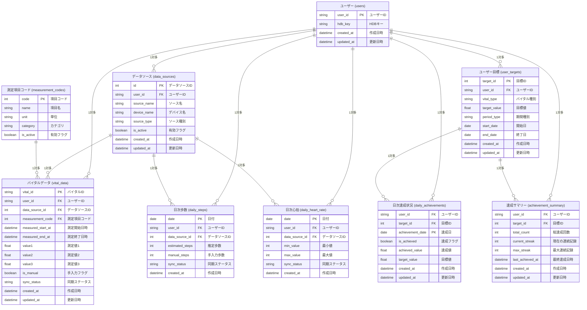

# アプリ内部DB ER図

## コアテーブル説明

### ユーザー管理
- **users**: ユーザーの基本認証情報（HDBキー含む）

### バイタルデータ管理
- **data_sources**: データソース情報（HealthKit、ヘルスコネクト、手入力等）
- **measurement_codes**: 測定項目コードマスター（1000:歩数、1100:体重、1200:血圧等）
- **vital_data**: 統合バイタルデータ（全測定項目を統一管理）
- **daily_steps**: 1日の歩数集計データ（パフォーマンス最適化）
- **daily_heart_rate**: 1日の心拍数集計データ（パフォーマンス最適化）

### 目標管理
- **user_targets**: ユーザーが設定する個人目標（自分で入力）
- **daily_achievements**: 日ごとの目標達成状況を詳細管理
- **achievement_summary**: 達成回数や連続記録のサマリー情報

## 設計思想

### シンプルな統合データ管理
- **vital_data**: 全バイタルデータを測定項目コードで統一管理
- **measurement_codes**: コード体系による拡張性確保
- **data_sources**: デバイス・アプリ別データソース管理

### パフォーマンス最適化
- **daily_steps/daily_heart_rate**: 日次集計テーブルで高速データ取得
- 複数データソース間での最大値選択ロジック

### 多値データ対応
- **value1/value2/value3**: 血圧（収縮期/拡張期）等の複数値データを効率格納
- Health Connect/HealthKitからの複合データに対応

### 測定項目コード一覧
| コード | 項目名 | 単位 | 格納方法 |
|-------|--------|------|----------|
| 1000 | 歩数（概算） | 歩 | value1 |
| 1001 | 歩数（手入力） | 歩 | value1 |
| 1100 | 体重 | kg | value1 |
| 1101 | 体脂肪率 | % | value1 |
| 1200 | 血圧 | mmHg | value1:収縮期, value2:拡張期 |
| 1210 | 心拍数 | bpm | value1 |
| 1400 | 体温 | ℃ | value1 |