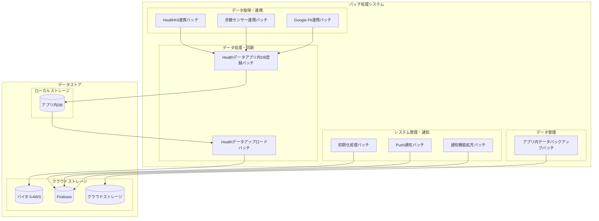
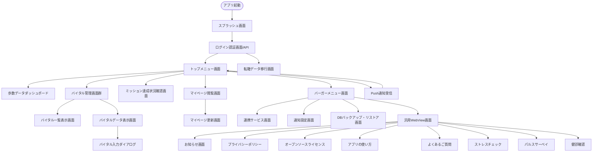
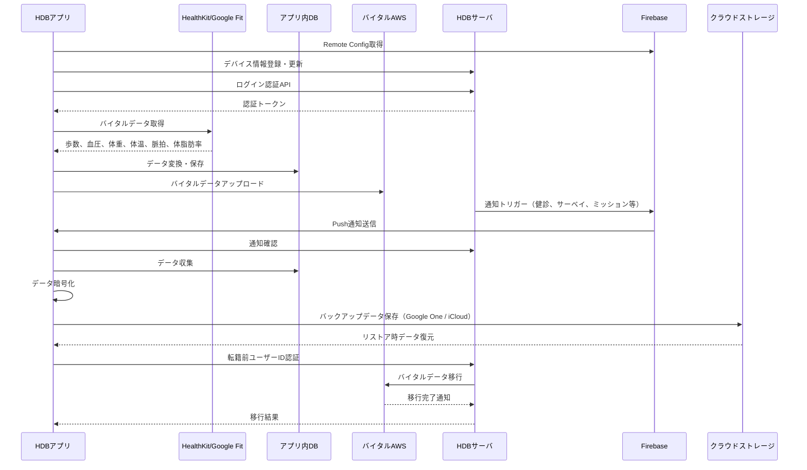

# HDBシステム構成図

## 全体システム構成

```mermaid
graph TB
    subgraph "クライアント層"
        subgraph "HDBアプリ iOS/Android"
            subgraph "認証・基本機能"
                A1[スプラッシュ画面]
                A2[ログイン認証API]
                A3[トップメニュー画面]
                A6[マイページ]
                A7[バーガーメニュー]
                A8[汎用WebView]
            end
            
            subgraph "バイタルデータ管理"
                A4[歩数データダッシュボード]
                A5[バイタル管理画面群]
            end
            
            subgraph "サービス連携・通知"
                A9[ミッション機能]
                A10[通知設定画面]
                A11[連携サービス画面]
            end
            
            subgraph "データ管理"
                A12[DBバックアップ・リストア]
                A13[転籍データ移行画面]
            end
        end
        
        subgraph "HDB Web 個人向け"
            subgraph "認証・基本画面"
                W1[ログイン認証画面]
                W2[トップメニュー画面]
                W3[バイタルデータ表示画面]
                W4[お知らせ画面]
            end
            
            subgraph "情報・ヘルプ"
                W5[プライバシーポリシー]
                W6[オープンソースライセンス]
                W7[アプリの使い方]
                W8[よくあるご質問]
            end
            
            subgraph "健康管理サービス"
                W9[ストレスチェック]
                W10[パルスサーベイ]
                W11[健診確認]
            end
        end
    end
    
    subgraph "データソース層"
        subgraph "iOS健康データ"
            D1[HealthKit iOS]
        end
        
        subgraph "Android健康データ"
            D2[Google Fit Health Connect Android]
            D3[SensorManager Android]
            D4[Recording API Android]
        end
    end
    
    subgraph "クラウドサービス層"
        subgraph "Firebase"
            C1[Firebase Remote Config]
            C2[Push通知サービス Firebase]
        end
        
        subgraph "バックアップサービス"
            C3[Google One バックアップ]
            C4[iCloud バックアップ]
        end
    end
    
    subgraph "サーバ層"
        subgraph "バイタルデータ管理"
            S1[バイタルAWS]
        end
        
        subgraph "HDBサーバ群"
            S2[HDBサーバ 個人向け]
            S3[HDBサーバ スタッフ向け]
        end
        
        subgraph "認証サービス"
            S4[SSO API]
        end
    end
    
    subgraph "データベース層"
        subgraph "ローカルDB"
            DB1[(アプリ内DB SQLite)]
        end
        
        subgraph "クラウドDB"
            DB2[(バイタルAWS DB)]
            DB3[(HDBサーバ DB)]
        end
    end
    
    %% データフロー
    D1 --> A5
    D2 --> A5  
    D3 --> A5
    D4 --> A5
    A8 --> W1
    A8 --> W2
    A8 --> W3
    A8 --> W4
    A8 --> W5
    A8 --> W6
    A8 --> W7
    A8 --> W8
    A8 --> W9
    A8 --> W10
    A8 --> W11
    C1 --> A1
    C2 --> A6
    C2 --> A10
    A5 --> DB1
    DB1 --> S1
    A2 --> S2
    A13 --> S2
    W1 --> S2
    A12 --> C3
    A12 --> C4
    S1 --> DB2
    S2 --> DB3
    S3 --> DB3
    S4 --> A8
```

## バッチ処理システム構成

```mermaid
graph TB
    subgraph "バッチ処理システム"
        subgraph "データ取得・連携"
            B1[HealthKit連携バッチ]
            B2[歩数センサー連携バッチ]
            B3[Google Fit連携バッチ]
        end
        
        subgraph "データ処理・同期"
            B4[Healthデータアプリ内DB登録バッチ]
            B5[Healthデータアップロードバッチ]
        end
        
        subgraph "システム管理・通知"
            B6[初期化処理バッチ]
            B7[Push通知バッチ]
            B8[通知機能拡充バッチ]
        end
        
        subgraph "データ管理"
            B9[アプリ内データバックアップバッチ]
        end
    end
    
    subgraph "データストア"
        subgraph "ローカルストレージ"
            DB1[(アプリ内DB)]
        end
        
        subgraph "クラウドストレージ"
            DB2[(バイタルAWS)]
            DB3[(Firebase)]
            DB4[(クラウドストレージ)]
        end
    end
    
    %% バッチフロー
    B1 --> B4
    B2 --> B4
    B3 --> B4
    B4 --> DB1
    B5 --> DB2
    B6 --> DB3
    B7 --> DB3
    B8 --> DB3
    B9 --> DB4
    DB1 --> B5
```

## 画面遷移フロー

```mermaid
flowchart TD
    START([アプリ起動]) --> SP[スプラッシュ画面]
    SP --> LOGIN[ログイン認証画面/API]
    LOGIN --> TOP[トップメニュー画面]
    
    TOP --> DASH[歩数データダッシュボード]
    TOP --> VITAL[バイタル管理画面群]
    TOP --> MISSION[ミッション達成状況確認画面]
    TOP --> MYPAGE[マイページ閲覧画面]
    
    VITAL --> VITAL_LIST[バイタル一覧表示画面]
    VITAL --> VITAL_DISP[バイタルデータ表示画面]
    VITAL_DISP --> VITAL_INPUT[バイタル入力ダイアログ]
    
    MYPAGE --> MYPAGE_EDIT[マイページ更新画面]
    
    TOP --> BURGER[バーガーメニュー画面]
    BURGER --> SERVICE[連携サービス画面]
    BURGER --> NOTIFY[通知設定画面]
    BURGER --> BACKUP[DBバックアップ・リストア画面]
    BURGER --> WEBVIEW[汎用WebView画面]
    
    LOGIN --> TRANSFER[転籍データ移行画面]
    
    %% WebView画面遷移
    WEBVIEW --> WEB_NOTICE[お知らせ画面]
    WEBVIEW --> WEB_PRIVACY[プライバシーポリシー]
    WEBVIEW --> WEB_LICENSE[オープンソースライセンス]
    WEBVIEW --> WEB_HELP[アプリの使い方]
    WEBVIEW --> WEB_FAQ[よくあるご質問]
    WEBVIEW --> WEB_STRESS[ストレスチェック]
    WEBVIEW --> WEB_PULSE[パルスサーベイ]
    WEBVIEW --> WEB_HEALTH[健診確認]
    
    %% 通知関連
    TOP --> PUSH_NOTICE[Push通知受信]
    PUSH_NOTICE --> TOP
```

## データフロー詳細

```mermaid
sequenceDiagram
    participant App as HDBアプリ
    participant HealthKit as HealthKit/Google Fit
    participant LocalDB as アプリ内DB
    participant AWS as バイタルAWS
    participant HDB as HDBサーバ
    participant Firebase as Firebase
    participant Cloud as クラウドストレージ
    
    %% 初期化フロー
    App->>Firebase: Remote Config取得
    App->>HDB: デバイス情報登録・更新
    
    %% 認証フロー
    App->>HDB: ログイン認証API
    HDB-->>App: 認証トークン
    
    %% バイタルデータ取得・保存フロー
    App->>HealthKit: バイタルデータ取得
    HealthKit-->>App: 歩数、血圧、体重、体温、脈拍、体脂肪率
    App->>LocalDB: データ変換・保存
    App->>AWS: バイタルデータアップロード
    
    %% ミッション・通知フロー
    HDB->>Firebase: 通知トリガー（健診、サーベイ、ミッション等）
    Firebase->>App: Push通知送信
    App->>HDB: 通知確認
    
    %% バックアップ・リストアフロー
    App->>LocalDB: データ収集
    App->>App: データ暗号化
    App->>Cloud: バックアップデータ保存（Google One / iCloud）
    Cloud-->>App: リストア時データ復元
    
    %% 転籍データ移行フロー
    App->>HDB: 転籍前ユーザーID認証
    HDB->>AWS: バイタルデータ移行
    AWS-->>HDB: 移行完了通知
    HDB-->>App: 移行結果
```

## 技術スタック構成

```mermaid
graph TB
    subgraph "フロントエンド技術"
        subgraph "React Native基盤"
            F1[React Native 0.80.0]
            F2[TypeScript 5.0.4]
            F3[React Navigation]
            F4[WebView React Native]
        end
    end
    
    subgraph "モバイル連携技術"
        subgraph "iOS健康データ連携"
            M1[HealthKit iOS]
            M6[CMPedometer iOS]
        end
        
        subgraph "Android健康データ連携"
            M2[Google Fit Android]
            M3[Health Connect Android]
            M4[SensorManager Android]
            M5[Recording API Android]
        end
    end
    
    subgraph "クラウドサービス"
        subgraph "Firebase サービス"
            C1[Firebase Remote Config]
            C2[Firebase Push Notifications]
        end
        
        subgraph "AWS サービス"
            C3[AWS バイタルサービス]
        end
        
        subgraph "バックアップサービス"
            C4[Google One バックアップ]
            C5[iCloud バックアップ]
        end
    end
    
    subgraph "データ永続化"
        subgraph "ローカルストレージ"
            DB1[SQLite アプリ内DB]
        end
        
        subgraph "クラウドデータベース"
            DB2[AWS RDS バイタルDB]
            DB3[HDBサーバ DB]
        end
    end
    
    subgraph "API・認証"
        subgraph "認証サービス"
            A1[HDB認証API]
            A2[SSO API]
        end
        
        subgraph "データ連携API"
            A3[バイタルアップロードAPI]
        end
    end
    
    F1 --> M1
    F1 --> M2
    F1 --> M3
    F1 --> M4
    F1 --> M5
    F1 --> M6
    F1 --> C1
    F1 --> C2
    F1 --> C3
    F1 --> C4
    F1 --> C5
    F1 --> DB1
    F1 --> A1
    F1 --> A2
    F1 --> A3
    C3 --> DB2
    A1 --> DB3
    A2 --> DB3
    A3 --> DB2
```