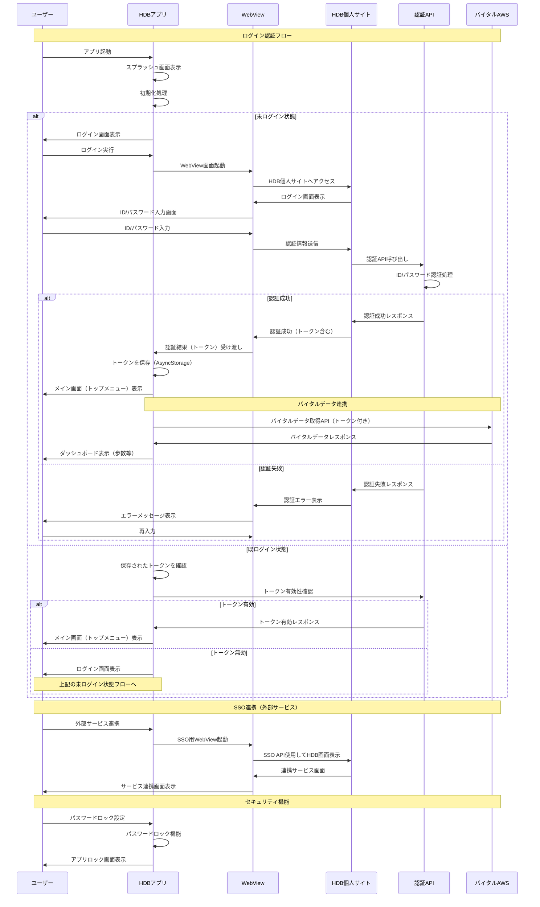

# ログイン認証とWebview認証のシーケンス図

## 概要
HDBアプリにおけるログイン認証時のWebview認証とトークン取得の流れを示すシーケンス図です。

## シーケンス図

## 主要な認証要素

### 1. ログイン認証
- **項番1**: ID/パスワード認証（パスワードロック機能付き）
- **項番3**: スマートフォン向け認証API（クリエイティブヘルス方式）
- **項番80**: 汎用WebView画面（静的ページ/SSO API使用）

### 2. トークン管理
- WebView認証後にトークンを取得
- AsyncStorageでトークンを永続化
- トークンの有効性確認機能

### 3. 外部サービス連携
- シングルサインオン（SSO）対応
- 外部サービスへの認証連携

### 4. セキュリティ機能
- パスワードロック機能
- デバイス情報の登録・更新（項番81）

## 技術的実装ポイント

1. **WebView統合**: JavaScript呼び出しによるアプリ・WebView間の連携
2. **トークン管理**: AsyncStorageを使用した認証情報の永続化
3. **SSO対応**: 外部サービスとの認証連携
4. **エラーハンドリング**: 認証失敗時の適切な画面遷移
5. **セキュリティ**: パスワードロック機能による追加セキュリティ層

## 参考情報
- 開発対象機能一覧.tsv の項番1, 3, 80, 81を基に作成
- WebViewとJavaScriptの連携機能を活用
- 外部サービスとのSSO連携を考慮した設計