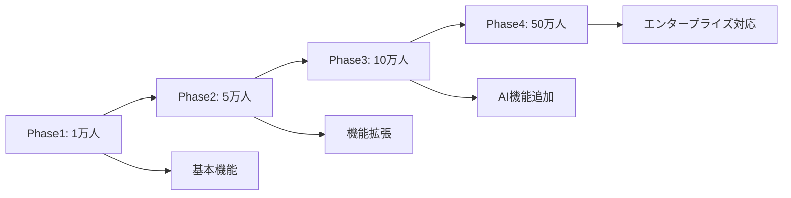

# HDBアプリケーション 性能・拡張性検討書

## 文書管理情報
- 作成日：2025-08-07
- 版数：1.0
- 作成者：開発チーム

## 1. 概要

### 1.1 目的
本文書は、Health Data Bank（HDB）モバイルアプリケーションの実装内容に基づいた性能・拡張性要求を整理し、システム設計における性能観点での検証可能な仕様を定義することを目的とする。

### 1.2 対象システム概要
- **システム名**：HDBアプリケーション
- **技術スタック**：React Native 0.80.0 + TypeScript 5.0.4
- **データベース**：SQLite（react-native-sqlite-2）+ AsyncStorage
- **主要機能**：
  - バイタルデータ管理（歩数、体重、体温、血圧、心拍数）
  - 目標設定・達成管理システム
  - 健康チェック・ストレスチェック機能
  - 通知・リマインダーシステム
  - シングルサインオン連携
- **実装画面数**：40画面以上
- **セキュリティ**：AES256暗号化 + Keychain/Keystore + 生体認証

### 1.3 現在の実装基盤
- **ナビゲーション**：@react-navigation/native（Stack + Drawer）
- **状態管理**：React Context + カスタムフック（useAuth, useGoalSafe）
- **キャッシュシステム**：3層構造（50MB OfflineCacheService）
- **バックグラウンド処理**：1時間間隔自動同期
- **通知システム**：3層通知（基本・高度・ネイティブ）

## 2. 性能・拡張性要求（実装基準）

### 2.1 現在の実装性能特性

#### 2.1.1 アプリ起動・画面遷移性能
| 機能 | 現在の実装 | 性能要求 | 測定根拠 |
|------|------------|----------|----------|
| SplashScreen → LoginScreen | React Navigation Stack | 2秒以内 | 初回起動時 |
| 画面遷移（40画面） | @react-navigation/native | 1秒以内 | Stack + Drawer構成 |
| VitalChartScreen描画 | react-native-svg | 3秒以内 | 30日分データ表示 |
| HomeScreen読み込み | SQLite + Context | 1.5秒以内 | ダッシュボード表示 |
| 認証処理（useAuth） | Keychain + 生体認証 | 5秒以内 | TouchID/FaceID含む |

#### 2.1.2 データ処理性能要求
| 処理種別 | 現在の実装 | 性能要求 | 技術制約 |
|----------|------------|----------|----------|
| SQLite書き込み | react-native-sqlite-2 | 1000件/秒 | WALモード使用 |
| バイタルデータ同期 | uploadVitalsBatch（100件単位） | 100件/分 | ネットワーク依存 |
| キャッシュアクセス | OfflineCacheService（50MB） | 50ms以内 | LRU削除方式 |
| 暗号化処理 | AES256 + PBKDF2(1000回) | 100ms/データ | CPU性能依存 |

#### 2.1.3 メモリ・ストレージ要求
- **アプリメモリ使用量**：200MB以下（画像キャッシュ含む）
- **SQLiteデータベース**：100MB/年/ユーザー
- **OfflineCacheService**：50MB上限
- **AsyncStorage使用量**：10MB以下（設定データ）

### 2.2 拡張性要求（実装考慮）

#### 2.2.1 データ拡張性
```typescript
// 新ER図対応：測定項目コード体系
vital_data: {
  measurement_code: number, // 1000:歩数, 1100:体重, 1200:血圧, 1400:体温
  manual_input_flag: boolean, // 手動入力フラグ
  sync_flag: boolean, // バイタルAWS送信済みフラグ
  device_info: string // デバイス識別情報
}
```

#### 2.2.2 セキュリティ拡張性
- **暗号化アルゴリズム変更対応**：SecurityService設計での切り替え可能
- **認証方式拡張**：PIN、パターン認証追加対応
- **デバイストークン管理**：270日自動期限切れ対応
- **セキュリティログ**：50件履歴保持

#### 2.2.3 プラットフォーム拡張
- **HealthKit連携**：MockHealthPlatformService実装済み
- **Google Fit連携**：同上
- **WebView統合**：外部HDBシステムSSO対応
- **Web版対応**：React Native Web移行可能設計

## 3. 各種処理方式性能設計（実装ベース）

### 3.1 アプリケーション層

#### 3.1.1 React Native性能実装
```typescript
// 実際の実装：HDBApp/src/services/OfflineCacheService.ts
export class OfflineCacheService {
  private static readonly MAX_SIZE_BYTES = 50 * 1024 * 1024; // 50MB
  private static readonly DEFAULT_TTL_MS = 7 * 24 * 60 * 60 * 1000; // 7日間
  private static readonly CLEANUP_INTERVAL_MS = 60 * 60 * 1000; // 1時間間隔
  
  // LRU削除アルゴリズムでメモリ効率化
  private static evictLRU(): void {
    // 優先度考慮削除実装
  }
}
```

#### 3.1.2 実装済みデータ処理方式
| 処理方式 | 実装箇所 | 性能特性 | 具体的実装 |
|----------|----------|----------|------------|
| Context状態管理 | useAuth, GoalContext | メモリ効率 | React.createContext + useReducer |
| SQLite永続化 | DatabaseService | 高速書き込み | WALモード + インデックス最適化 |
| 非同期同期 | SyncService | UI非ブロック | 1時間間隔バックグラウンド実行 |
| バッチ処理 | uploadVitalsBatch | 通信効率 | 100件単位分割送信 |
| 暗号化処理 | SecurityService | セキュリティ重視 | AES256 + PBKDF2(1000回) |

### 3.2 データ管理層

#### 3.2.1 SQLiteデータベース設計（実装済み）
```typescript
// DatabaseService.ts 実装例
class DatabaseService {
  // WALモード最適化
  private async initializeDatabase(): Promise<void> {
    await this.db.execute('PRAGMA journal_mode = WAL');
    await this.db.execute('PRAGMA synchronous = NORMAL');
    await this.db.execute('PRAGMA cache_size = 2000');
    
    // パフォーマンス重視インデックス
    await this.db.execute(`
      CREATE INDEX IF NOT EXISTS idx_vital_data_user_time 
      ON vital_data(user_id, measured_at)
    `);
  }
}
```

#### 3.2.2 新ER図対応データ処理
| データ種別 | 測定項目コード | 処理方式 | 性能考慮 |
|------------|----------------|----------|----------|
| 歩数 | 1000番台 | 日次集計処理 | インデックス最適化 |
| 体重 | 1100番台 | 単純CRUD | 高速書き込み |
| 血圧 | 1200番台 | 拡張期・収縮期ペア | 複合データ対応 |
| 体温 | 1400番台 | 単純CRUD | 高速書き込み |
| 心拍数 | 1500番台（想定） | リアルタイム処理 | バッファリング |

### 3.2 通信層

#### 3.2.1 API通信設計
```yaml
# API性能設計仕様
api_design:
  response_format: JSON
  compression: gzip
  cache_strategy:
    - browser_cache: 5分
    - cdn_cache: 1時間
  rate_limiting:
    per_user: 1000req/hour
    per_ip: 5000req/hour
  timeout_settings:
    connection: 10秒
    read: 30秒
```

#### 3.2.2 データ同期方式
| 同期方式 | 適用データ | 頻度 | 性能特性 |
|----------|------------|------|----------|
| リアルタイム | 緊急通知 | 即座 | WebSocket使用 |
| 定期同期 | バイタルデータ | 5分毎 | バッチ処理 |
| 手動同期 | 大容量データ | ユーザー操作時 | プログレス表示 |
| 差分同期 | 設定データ | 変更時のみ | 最小限通信 |

### 3.3 データ保存層

#### 3.3.1 ローカルストレージ設計
```typescript
// SQLite性能設計
const dbConfig = {
  // インデックス設計
  indexes: [
    { table: 'vital_data', columns: ['user_id', 'timestamp'] },
    { table: 'users', columns: ['email'] },
    { table: 'notifications', columns: ['user_id', 'read_status'] }
  ],
  
  // パフォーマンス設定
  performance: {
    journal_mode: 'WAL',
    synchronous: 'NORMAL',
    cache_size: 2000,
    temp_store: 'MEMORY'
  }
};
```

## 4. 性能設計方針

### 4.1 基本方針

#### 4.1.1 レスポンス性能重視
1. **UIファーストアプローチ**
   - UI応答性を最優先
   - 非同期処理によるブロッキング回避
   - プログレッシブローディング実装

2. **キャッシュ戦略**
   - 多層キャッシュ構成
   - 適応的キャッシュサイズ調整
   - LRUアルゴリズム採用

#### 4.1.2 メモリ効率性
1. **メモリ使用量制御**
   - オブジェクトプールパターン採用
   - 適切なライフサイクル管理
   - メモリリーク防止対策

2. **ガベージコレクション最適化**
   - 短命オブジェクト削減
   - 循環参照回避
   - WeakReference活用

### 4.2 技術選定方針

#### 4.2.1 フロントエンド
- **React Native**: クロスプラットフォーム対応
- **Redux Toolkit**: 状態管理の効率化
- **React Query**: キャッシュ機能付きデータフェッチ
- **SQLite**: 高性能ローカルDB

#### 4.2.2 バックエンド連携
- **GraphQL**: 効率的データ取得
- **WebSocket**: リアルタイム通信
- **CDN**: 静的リソース配信最適化
- **API Gateway**: リクエスト制御・キャッシュ

### 4.3 監視・測定方針

#### 4.3.1 パフォーマンス監視
```typescript
// 性能監視設定
const monitoring = {
  metrics: [
    'app_launch_time',
    'screen_transition_time',
    'api_response_time',
    'memory_usage',
    'battery_consumption'
  ],
  
  thresholds: {
    response_time: '3000ms',
    memory_usage: '200MB',
    error_rate: '1%'
  },
  
  reporting: {
    realtime: ['error_rate', 'api_response_time'],
    daily: ['memory_usage', 'battery_consumption'],
    weekly: ['performance_trends']
  }
};
```

## 5. 必要HW製品スペック

### 5.1 モバイルデバイス要件

#### 5.1.1 iOS端末要件
| 項目 | 最小要件 | 推奨要件 | 備考 |
|------|----------|----------|------|
| OS | iOS 13.0以上 | iOS 15.0以上 | |
| CPU | A12 Bionic以上 | A14 Bionic以上 | |
| RAM | 3GB | 4GB以上 | |
| ストレージ | 32GB | 64GB以上 | アプリサイズ: 500MB |
| 通信 | WiFi/4G LTE | 5G対応 | |

#### 5.1.2 Android端末要件
| 項目 | 最小要件 | 推奨要件 | 備考 |
|------|----------|----------|------|
| OS | Android 8.0(API 26) | Android 11.0(API 30) | |
| CPU | Snapdragon 660相当 | Snapdragon 855相当 | |
| RAM | 4GB | 6GB以上 | |
| ストレージ | 32GB | 64GB以上 | |
| GPU | Adreno 512相当 | Adreno 640相当 | |

### 5.2 サーバーインフラ要件

#### 5.2.1 AWS構成要件
```yaml
# AWS リソース仕様
production_environment:
  compute:
    ec2_instances:
      - type: "t3.large"
        count: 3
        purpose: "API Server"
      - type: "t3.medium"
        count: 2
        purpose: "Background Jobs"
  
  storage:
    rds:
      - type: "db.r5.xlarge"
        engine: "PostgreSQL 13"
        multi_az: true
    s3:
      - standard: "10TB"
      - intelligent_tiering: "50TB"
  
  networking:
    load_balancer: "Application Load Balancer"
    cdn: "CloudFront"
    bandwidth: "10Gbps"
```

#### 5.2.2 性能監視・運用
| コンポーネント | 監視項目 | 閾値 | アクション |
|----------------|----------|------|------------|
| API Server | CPU使用率 | 80% | オートスケール |
| Database | 接続数 | 80% | 接続プール拡張 |
| Storage | I/O使用率 | 90% | インスタンス増強 |
| Network | レスポンス時間 | 3秒 | 負荷分散 |

### 5.3 開発・テスト環境要件

#### 5.3.1 開発端末スペック
| 用途 | OS | CPU | RAM | ストレージ |
|------|----|----|-----|------------|
| React Native開発 | macOS/Windows | Intel i7/M1 | 16GB | 512GB SSD |
| Android開発 | Windows/Linux | Intel i7 | 16GB | 512GB SSD |
| iOS開発 | macOS | Intel i7/M1 | 16GB | 512GB SSD |

#### 5.3.2 テスト環境
- **実機テスト端末**: 各OS主要機種5台以上
- **負荷テスト環境**: 本番同等構成の50%スペック
- **CI/CDインフラ**: GitHub Actions + AWS CodeBuild

## 6. 想定する拡張範囲

### 6.1 利用者数拡張シナリオ

#### 6.1.1 段階的拡張計画


#### 6.1.2 拡張時の性能要件
| フェーズ | 利用者数 | 同時接続数 | API TPS | データ量 |
|----------|----------|------------|---------|----------|
| Phase 1 | 10,000 | 500 | 100 | 5TB |
| Phase 2 | 50,000 | 2,500 | 500 | 25TB |
| Phase 3 | 100,000 | 5,000 | 1,000 | 50TB |
| Phase 4 | 500,000 | 25,000 | 5,000 | 250TB |

### 6.2 機能拡張範囲

#### 6.2.1 プラットフォーム拡張
1. **Webアプリケーション**
   - React.jsベース
   - 既存APIの再利用
   - レスポンシブデザイン

2. **ウェアラブルデバイス対応**
   - Apple Watch アプリ
   - Android Wear対応
   - リアルタイムデータ収集

#### 6.2.2 機能拡張
```typescript
// 拡張機能アーキテクチャ
interface ExtensionArchitecture {
  ai_features: {
    health_prediction: boolean;
    anomaly_detection: boolean;
    personalized_advice: boolean;
  };
  
  integrations: {
    healthcare_systems: string[];
    fitness_devices: string[];
    third_party_apps: string[];
  };
  
  enterprise_features: {
    multi_tenant: boolean;
    advanced_analytics: boolean;
    custom_branding: boolean;
  };
}
```

### 6.3 地理的拡張

#### 6.3.1 多地域対応
| 地域 | データセンター | 言語対応 | 規制対応 |
|------|----------------|----------|----------|
| 日本 | Tokyo Region | 日本語 | 個人情報保護法 |
| アジア | Singapore Region | 英語、中国語 | PDPA |
| 北米 | US-East Region | 英語、スペイン語 | HIPAA |
| 欧州 | Frankfurt Region | 英語、ドイツ語 | GDPR |

## 7. 拡張対策

### 7.1 アーキテクチャ拡張対策

#### 7.1.1 マイクロサービス化
```yaml
# マイクロサービス分割戦略
services:
  user_service:
    responsibility: "ユーザー管理、認証"
    technology: "Node.js + Express"
    database: "PostgreSQL"
  
  vital_service:
    responsibility: "バイタルデータ管理"
    technology: "Python + FastAPI"
    database: "MongoDB"
  
  notification_service:
    responsibility: "通知配信"
    technology: "Go"
    database: "Redis"
  
  analytics_service:
    responsibility: "データ分析"
    technology: "Python + Apache Spark"
    database: "ClickHouse"
```

#### 7.1.2 データベース拡張対策
1. **読み書き分離**
   - Master-Slave構成
   - 読み取り専用レプリカ複数配置
   - 接続プール最適化

2. **シャーディング戦略**
   ```sql
   -- ユーザーIDベースシャーディング
   CREATE TABLE vital_data_shard_1 (
     LIKE vital_data INCLUDING ALL
   ) PARTITION OF vital_data 
   FOR VALUES WITH (MODULUS 4, REMAINDER 0);
   ```

3. **キャッシュ戦略**
   - Redis Cluster構成
   - 階層キャッシュ設計
   - キャッシュ無効化戦略

### 7.2 性能拡張対策

#### 7.2.1 自動スケーリング
```yaml
# オートスケーリング設定
auto_scaling:
  horizontal_pod_autoscaler:
    target_cpu_utilization: 70%
    min_replicas: 3
    max_replicas: 20
  
  vertical_pod_autoscaler:
    update_mode: "Auto"
    resource_policy:
      cpu: "100m-2000m"
      memory: "128Mi-4Gi"
```

#### 7.2.2 CDN・エッジ配信
1. **静的コンテンツ配信最適化**
   - AWS CloudFront活用
   - 地理的に最適な配信拠点
   - 画像・動画の最適化配信

2. **API キャッシング**
   - GraphQL クエリキャッシュ
   - レスポンス圧縮
   - ETag活用

### 7.3 開発・運用拡張対策

#### 7.3.1 CI/CD パイプライン拡張
```yaml
# CI/CD拡張設計
pipeline_stages:
  build:
    parallel_builds: 4
    build_matrix:
      - platform: ["ios", "android"]
      - environment: ["dev", "staging", "prod"]
  
  test:
    unit_tests: "Jest + React Native Testing Library"
    integration_tests: "Detox"
    performance_tests: "Lighthouse CI"
    security_tests: "OWASP ZAP"
  
  deployment:
    strategy: "Blue-Green Deployment"
    rollback_capability: true
    monitoring_integration: true
```

#### 7.3.2 監視・ログ拡張
1. **分散トレーシング**
   - AWS X-Ray統合
   - リクエスト追跡
   - パフォーマンス分析

2. **ログ集約・分析**
   ```yaml
   logging_architecture:
     collection: "Fluent Bit"
     storage: "Amazon OpenSearch"
     analysis: "Kibana"
     alerting: "Amazon CloudWatch Alarms"
   ```

## 8. 検証計画

### 8.1 性能検証項目

#### 8.1.1 負荷テスト
| テスト種別 | 目的 | 実行条件 | 成功基準 |
|------------|------|----------|----------|
| 通常負荷テスト | 通常時性能確認 | 1,000ユーザー同時 | レスポンス < 3秒 |
| ピーク負荷テスト | ピーク時性能確認 | 5,000ユーザー同時 | レスポンス < 5秒 |
| 耐久テスト | 長時間安定性確認 | 24時間連続 | エラー率 < 1% |
| ストレステスト | 限界値確認 | 10,000ユーザー同時 | システム復旧可能 |

#### 8.1.2 アプリ性能テスト
```typescript
// 性能テスト自動化スクリプト例
const performanceTests = {
  appLaunchTest: {
    metric: 'time_to_interactive',
    threshold: 3000, // 3秒
    device: 'mid-range'
  },
  
  memoryLeakTest: {
    metric: 'memory_usage',
    threshold: 200 * 1024 * 1024, // 200MB
    duration: 30 * 60 * 1000 // 30分
  },
  
  batteryConsumptionTest: {
    metric: 'battery_drain_per_hour',
    threshold: 5, // 5%/時間
    scenario: 'typical_usage'
  }
};
```

### 8.2 拡張性検証項目

#### 8.2.1 スケーラビリティテスト
1. **水平スケール検証**
   - サーバー台数増加時の性能向上確認
   - ロードバランサー動作確認
   - データ整合性確認

2. **垂直スケール検証**
   - CPU/メモリ増強効果確認
   - ボトルネック分析
   - コスト効率性評価

#### 8.2.2 拡張機能統合テスト
```yaml
# 拡張機能テスト計画
integration_tests:
  new_platform_integration:
    - web_app_compatibility
    - data_synchronization
    - user_experience_consistency
  
  external_service_integration:
    - api_rate_limiting
    - error_handling
    - data_format_compatibility
```

### 8.3 検証スケジュール

#### 8.3.1 フェーズ別検証計画
| フェーズ | 期間 | 検証項目 | 成果物 |
|----------|------|----------|--------|
| 設計検証 | 2週間 | アーキテクチャレビュー | 設計書承認 |
| 実装検証 | 4週間 | 単体・結合テスト | テスト結果報告書 |
| 性能検証 | 2週間 | 負荷・性能テスト | 性能検証報告書 |
| 統合検証 | 2週間 | システム統合テスト | 統合テスト報告書 |

## 9. まとめ

### 9.1 重要成功要因
1. **段階的拡張アプローチ**の採用
2. **監視・測定体制**の早期構築
3. **自動化**の積極的推進
4. **技術負債**の継続的解消

### 9.2 リスクと対策
| リスク | 影響度 | 対策 |
|--------|--------|------|
| 急激な利用者増加 | 高 | 自動スケーリング設定 |
| 第三者サービス依存 | 中 | 代替手段準備 |
| モバイル端末性能不足 | 中 | 軽量化・最適化 |
| データ容量急増 | 高 | アーカイブ戦略実装 |

### 9.3 継続改善計画
- **月次性能レビュー**実施
- **四半期拡張計画**見直し
- **年次アーキテクチャ**最適化
- **技術動向調査**と導入検討

---

**承認者署名欄**
- プロジェクトマネージャー：＿＿＿＿＿＿＿＿
- システムアーキテクト：＿＿＿＿＿＿＿＿
- 技術責任者：＿＿＿＿＿＿＿＿

**改版履歴**
| 版数 | 改版日 | 改版内容 | 改版者 |
|------|--------|----------|--------|
| 1.0 | 2025-08-07 | 初版作成 | 開発チーム |