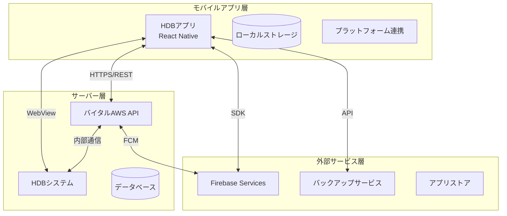
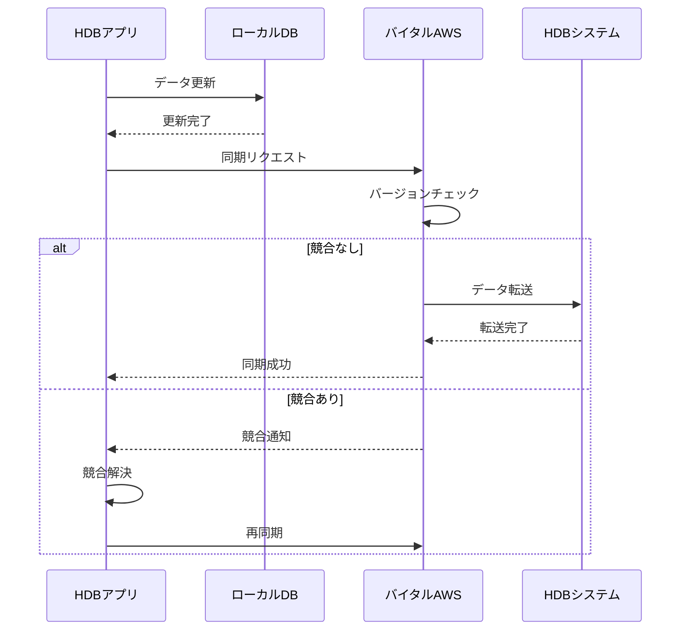
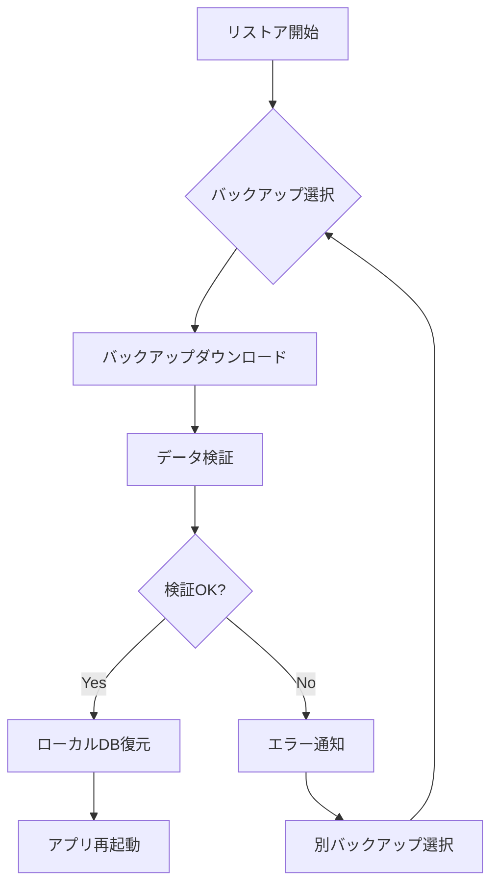
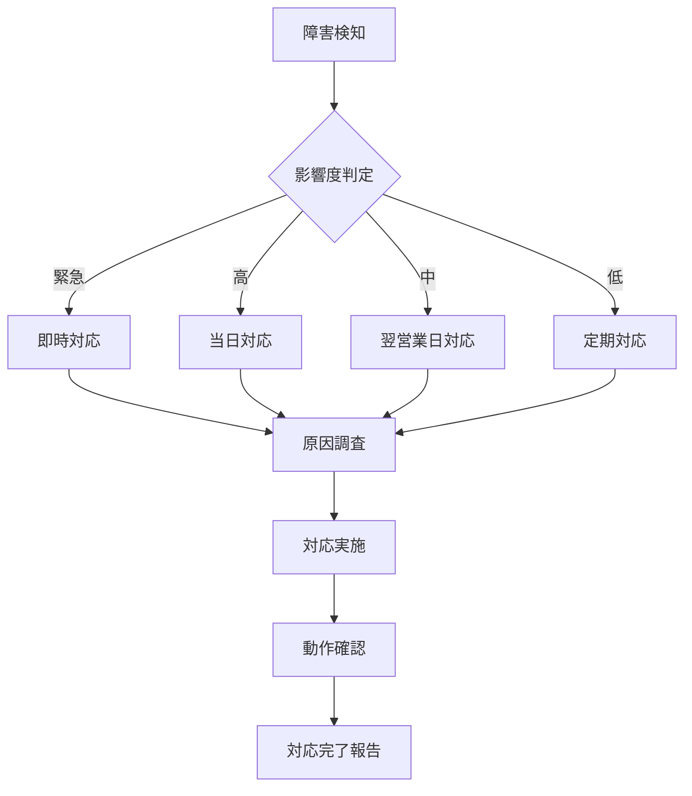

# 連携処理方式概要設計書

## 1. ドキュメント情報

| 項目 | 内容 |
|---|---|
| ドキュメント名 | 連携処理方式概要設計書 |
| バージョン | 1.0 |
| 作成日 | 2025-08-21 |
| 対象システム | HDBアプリケーション |
| 文書の目的 | ソフトウェア間・システム間の連携に用いる処理の仕組みとして、通信方式、トランザクション管理方式、リカバリ、異常処理方式、システム基盤制御ツール、運用作業支援ツールなどを検討し、連携を実現させるうえで必要な事項を概要レベルで網羅的に整理し、検証可能にする |

## 2. システム連携構成概要



## 3. 通信方式

### 3.1 アプリケーション間通信

#### 3.1.1 HDBアプリ ⇔ バイタルAWS API

| 項目 | 仕様 |
|---|---|
| プロトコル | HTTPS (TLS 1.2以上) |
| 通信方式 | REST API |
| データ形式 | JSON |
| 認証方式 | JWT (JSON Web Token) |
| タイムアウト | 30秒 |
| リトライ | 最大3回（指数バックオフ） |

**主要API**
- ユーザー認証: POST /api/auth/login
- バイタルデータ同期: POST /api/vitals/sync
- バックアップ: POST /api/backup/upload
- リストア: GET /api/backup/download

#### 3.1.2 HDBアプリ ⇔ HDBシステム

| 項目 | 仕様 |
|---|---|
| プロトコル | HTTPS |
| 通信方式 | WebView経由 |
| 認証方式 | セッションベース認証 |
| Cookie管理 | WebView内で自動管理 |

#### 3.1.3 HDBアプリ ⇔ Firebase

| 項目 | 仕様 |
|---|---|
| プロトコル | HTTPS |
| 通信方式 | Firebase SDK |
| 認証方式 | Firebase App ID |
| プッシュ通知 | FCM (Firebase Cloud Messaging) |
| 設定配信 | Remote Config |

### 3.2 サーバー間通信

#### 3.2.1 バイタルAWS ⇔ HDBシステム

| 項目 | 仕様 |
|---|---|
| プロトコル | HTTPS |
| 通信方式 | REST API |
| 認証方式 | API Key + IP制限 |
| データ形式 | JSON/CSV |

### 3.3 プラットフォーム連携

#### 3.3.1 HealthKit連携（iOS）

| 項目 | 仕様 |
|---|---|
| SDK | HealthKit Framework |
| データ取得 | バックグラウンド更新 |
| 権限管理 | ユーザー許可制 |
| 同期頻度 | 1日1回（深夜2時） |

#### 3.3.2 ヘルスコネクト連携（Android）

| 項目 | 仕様 |
|---|---|
| SDK | Health Connect API |
| データ取得 | バックグラウンド更新 |
| 権限管理 | ユーザー許可制 |
| 同期頻度 | 1日1回（深夜2時） |

## 4. トランザクション管理方式

### 4.1 トランザクション制御

#### 4.1.1 ローカルトランザクション

| 処理 | 方式 |
|---|---|
| SQLite操作 | BEGIN/COMMIT/ROLLBACK |
| 分離レベル | SERIALIZABLE |
| ロック方式 | 排他制御（WALモード） |

#### 4.1.2 分散トランザクション

| 処理 | 方式 |
|---|---|
| データ同期 | 楽観的ロック（バージョン管理） |
| 競合解決 | タイムスタンプベース |
| 整合性保証 | 結果整合性 |

### 4.2 データ同期管理



## 5. リカバリ方式

### 5.1 障害レベル定義

| レベル | 内容 | 対応方式 |
|---|---|---|
| L1 | ネットワーク一時障害 | 自動リトライ |
| L2 | アプリケーションエラー | エラーハンドリング・再起動 |
| L3 | データ不整合 | データ再同期 |
| L4 | システム障害 | バックアップからのリストア |

### 5.2 リカバリ処理

#### 5.2.1 自動リカバリ

| 障害種別 | リカバリ方式 |
|---|---|
| 通信タイムアウト | 指数バックオフによる自動リトライ（最大3回） |
| 認証エラー | トークン自動更新 |
| 一時的なDB障害 | トランザクションロールバック・再実行 |

#### 5.2.2 手動リカバリ

| 障害種別 | リカバリ方式 |
|---|---|
| データ消失 | バックアップからのリストア画面提供 |
| アカウント障害 | 再ログイン画面への誘導 |
| システム更新必要 | アプリ更新画面への誘導 |

### 5.3 バックアップ・リストア

#### 5.3.1 自動バックアップ

| 項目 | 仕様 |
|---|---|
| 頻度 | 1日1回（深夜3時） |
| 保存先 | バイタルAWS / iCloud / Google Drive |
| 保持期間 | 30日間 |
| 暗号化 | AES-256 |

#### 5.3.2 リストア処理



## 6. 異常処理方式

### 6.1 エラー分類

| 分類 | 内容 | 処理方式 |
|---|---|---|
| システムエラー | アプリ内部エラー | エラーログ記録・クラッシュレポート送信 |
| 通信エラー | ネットワーク障害 | リトライ・オフライン処理 |
| 業務エラー | 入力値不正など | ユーザーへのエラーメッセージ表示 |
| 外部サービスエラー | 連携先障害 | 代替処理・縮退運転 |

### 6.2 エラーハンドリング

#### 6.2.1 エラー処理フロー

```typescript
// エラー処理の基本パターン
try {
    // 通常処理
    const result = await apiCall();
    return result;
} catch (error) {
    // エラー分類
    if (isNetworkError(error)) {
        // リトライ処理
        return await retryWithBackoff(apiCall);
    } else if (isAuthError(error)) {
        // 認証更新
        await refreshAuth();
        return await apiCall();
    } else if (isBusinessError(error)) {
        // ユーザー通知
        showErrorMessage(error.message);
    } else {
        // システムエラー
        logError(error);
        showGenericError();
    }
}
```

#### 6.2.2 エラー通知

| 対象 | 通知方法 |
|---|---|
| ユーザー | アプリ内メッセージ・ダイアログ |
| 開発者 | クラッシュレポート（Firebase Crashlytics） |
| 運用者 | ログ集約・監視アラート |

### 6.3 オフライン処理

| 機能 | オフライン時動作 |
|---|---|
| データ入力 | ローカル保存・後で同期 |
| データ参照 | キャッシュデータ表示 |
| 認証 | キャッシュトークンで動作継続 |
| 通知 | ローカル通知のみ動作 |

## 7. システム基盤制御ツール

### 7.1 監視ツール

| ツール | 用途 | 監視項目 |
|---|---|---|
| Firebase Analytics | アプリ利用状況 | DAU、画面遷移、イベント |
| Firebase Crashlytics | クラッシュ監視 | クラッシュ率、エラー発生状況 |
| AWS CloudWatch | API監視 | レスポンスタイム、エラー率 |
| Firebase Performance | パフォーマンス監視 | 起動時間、API応答時間 |

### 7.2 ログ管理

#### 7.2.1 ログレベル

| レベル | 内容 | 出力先 |
|---|---|---|
| DEBUG | デバッグ情報 | 開発環境のみ |
| INFO | 一般情報 | ローカルファイル |
| WARN | 警告 | ローカル + リモート |
| ERROR | エラー | ローカル + リモート + アラート |

#### 7.2.2 ログローテーション

| 項目 | 仕様 |
|---|---|
| ローカル保持期間 | 7日間 |
| 最大サイズ | 10MB |
| ローテーション方式 | 日次 |

### 7.3 デプロイメント管理

| 環境 | ツール | 用途 |
|---|---|---|
| 開発 | React Native CLI | ローカルビルド・デバッグ |
| ステージング | TestFlight / Google Play Console | ベータテスト配信 |
| 本番 | App Store Connect / Google Play Console | 本番リリース |
| OTA更新 | CodePush（検討中） | 緊急パッチ配信 |

## 8. 運用作業支援ツール

### 8.1 運用管理ツール

| ツール | 機能 | 用途 |
|---|---|---|
| Firebase Console | 全体管理 | ユーザー管理、設定変更、通知送信 |
| AWS Console | インフラ管理 | API管理、データベース管理 |
| Remote Config | 設定管理 | 動的設定変更 |
| FCM Console | 通知管理 | プッシュ通知送信 |

### 8.2 運用手順

#### 8.2.1 定期メンテナンス

| 作業 | 頻度 | 内容 |
|---|---|---|
| ログ確認 | 日次 | エラーログ・異常動作確認 |
| バックアップ確認 | 週次 | バックアップ正常性確認 |
| パフォーマンス確認 | 月次 | レスポンスタイム分析 |
| セキュリティ更新 | 随時 | ライブラリ・SDK更新 |

#### 8.2.2 障害対応



### 8.3 サポートツール

| ツール | 用途 |
|---|---|
| リモートデバッグ | Chrome DevTools（React Native） |
| ログビューア | Flipper |
| APIテスト | Postman |
| 負荷テスト | JMeter |

## 9. セキュリティ考慮事項

### 9.1 通信セキュリティ

| 項目 | 対策 |
|---|---|
| 暗号化 | TLS 1.2以上必須 |
| 証明書検証 | Certificate Pinning実装 |
| API認証 | JWT + リフレッシュトークン |
| データ暗号化 | AES-256（保存時） |

### 9.2 データ保護

| 項目 | 対策 |
|---|---|
| 個人情報 | 暗号化保存 |
| 認証情報 | Keychain/Keystore使用 |
| 通信ログ | 個人情報マスキング |
| バックアップ | 暗号化必須 |

## 10. パフォーマンス要件

### 10.1 レスポンスタイム目標

| 処理 | 目標値 |
|---|---|
| アプリ起動 | 3秒以内 |
| 画面遷移 | 1秒以内 |
| API応答 | 2秒以内 |
| データ同期 | 10秒以内 |

### 10.2 可用性目標

| 項目 | 目標値 |
|---|---|
| サービス稼働率 | 99.5% |
| 計画停止 | 月1回以内 |
| MTTR | 4時間以内 |

## 11. 拡張性考慮事項

### 11.1 スケーラビリティ

| 項目 | 対応方針 |
|---|---|
| ユーザー数増加 | API自動スケーリング |
| データ量増加 | データベース分割 |
| 通信量増加 | CDN活用 |

### 11.2 将来拡張

| 機能 | 考慮事項 |
|---|---|
| 新規プラットフォーム | プラグイン形式で追加可能 |
| 新規連携先 | アダプターパターンで実装 |
| 新規データ形式 | 変換処理の抽象化 |

## 12. 検証項目

### 12.1 機能検証

- [ ] 各API通信の正常動作確認
- [ ] エラー処理の動作確認
- [ ] オフライン時の動作確認
- [ ] データ同期の整合性確認
- [ ] バックアップ・リストア動作確認

### 12.2 性能検証

- [ ] レスポンスタイム測定
- [ ] 同時接続数テスト
- [ ] データ量増加時の性能確認
- [ ] ネットワーク品質劣化時の動作確認

### 12.3 セキュリティ検証

- [ ] 通信暗号化確認
- [ ] 認証機能の脆弱性診断
- [ ] データ保護状態確認
- [ ] ペネトレーションテスト

## 13. 付録

### 13.1 用語集

| 用語 | 説明 |
|---|---|
| HDB | Health Data Bank（健康データバンク） |
| JWT | JSON Web Token（認証トークン形式） |
| FCM | Firebase Cloud Messaging（プッシュ通知サービス） |
| WAL | Write-Ahead Logging（SQLiteのジャーナリングモード） |
| MTTR | Mean Time To Repair（平均修復時間） |

### 13.2 参照資料

- HDBアプリケーション実装方式書
- セキュリティ方式概要設計書
- 全体システム構成図
- API仕様書
- データベース設計書