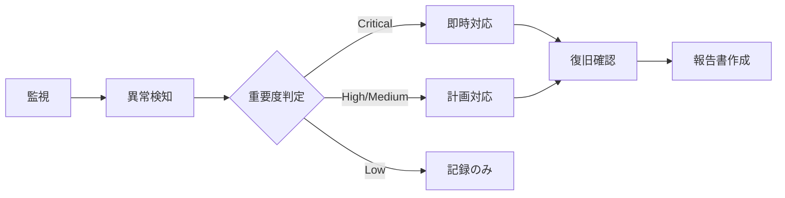
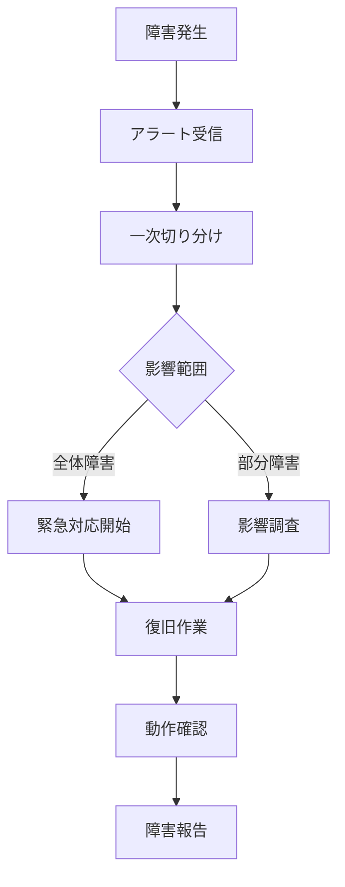
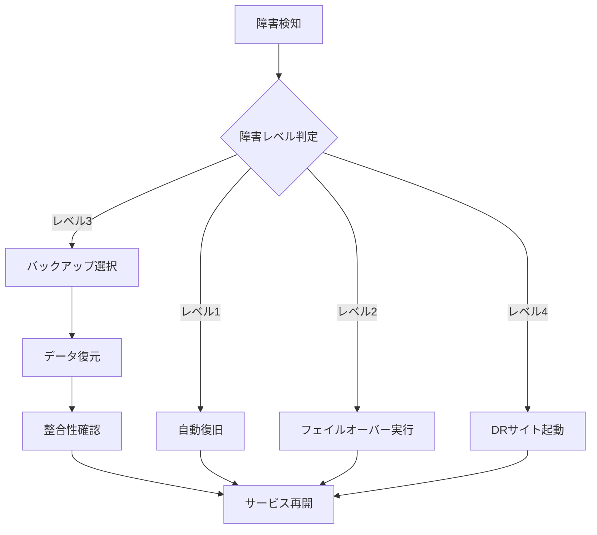
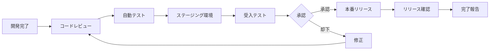

運用・保守性検討書 - 詳細設計方針

1. 概要

1.1 目的
本書は、Health Data Bank (HDB) モバイルアプリケーションシステムの運用・保守性に関する要求事項と設計方針を網羅的に整理し、検証可能な形で文書化することを目的とする。

1.2 対象システム
- システム名称：HDBモバイルアプリケーション
- プラットフォーム：iOS / Android
- アーキテクチャ：React Native + クラウドバックエンド（Firebase）
- サービス形態：24時間365日稼働のヘルスケアサービス

1.3 文書の役割
- 運用・保守性要求の明確化
- システム監視・運転管理方針の定義
- ログ管理・バックアップ戦略の策定
- リリース管理・保守方針の確立
- 検証可能な非機能要求の設定

2. 運用・保守性要求一覧

2.1 運用時間要求
| 項目 | 要求レベル | 説明 |
|------|------------|------|
| 通常運用時間 | レベル5 | 24時間365日無停止運用 |
| 特定日運用 | レベル5 | 年末年始・祝日も24時間稼働 |
| 計画停止 | レベル1 | 月1回深夜のメンテナンスウィンドウ設定 |
| 停止事前通知 | レベル2 | 1週間前にアプリ内通知 |

2.2 可用性要求
| 項目 | 目標値 | 実現方法 |
|------|--------|----------|
| サービス稼働率 | 99.9% | クラウド基盤の冗長構成 |
| RTO (Recovery Time Objective) | 1時間以内 | 自動フェイルオーバー |
| RPO (Recovery Point Objective) | 1分以内 | リアルタイムデータ同期 |
| MTBF (Mean Time Between Failures) | 30日以上 | 予防保守の実施 |
| MTTR (Mean Time To Repair) | 30分以内 | 自動復旧機能 |

2.3 保守性要求
| 項目 | 要求内容 | 実現方法 |
|------|----------|----------|
| パッチ適用 | セキュリティパッチ優先適用 | 定期保守時適用（緊急時は即時） |
| 活性保守 | 主要コンポーネント対応 | Blue-Greenデプロイメント |
| 予防保守 | リアルタイム予兆検出 | APM導入による監視 |
| 自動化範囲 | 主要保守作業の自動化 | CI/CDパイプライン |

3. システム監視設計方針

3.1 監視アーキテクチャ
```
┌─────────────────────────────────────────┐
│           監視ダッシュボード              │
│         (Grafana / Datadog)             │
└─────────────────────────────────────────┘
                    ▲
                    │
┌─────────────────────────────────────────┐
│           メトリクス収集層               │
│     (Prometheus / CloudWatch)           │
└─────────────────────────────────────────┘
        ▲           ▲           ▲
        │           │           │
┌───────────┐ ┌───────────┐ ┌───────────┐
│  アプリ    │ │   API     │ │    DB     │
│  監視      │ │   監視    │ │   監視    │
└───────────┘ └───────────┘ └───────────┘
```

3.2 監視項目と閾値設定

3.2.1 アプリケーション監視
| 監視項目 | 監視間隔 | 警告閾値 | 危険閾値 | アクション |
|----------|----------|----------|----------|------------|
| クラッシュ率 | リアルタイム | 0.5% | 1.0% | 自動アラート |
| ANR発生率 | リアルタイム | 0.3% | 0.5% | 自動アラート |
| API応答時間 | 1分 | 1秒 | 3秒 | スケールアウト |
| エラー率 | 1分 | 1% | 5% | エラー分析開始 |

3.2.2 インフラストラクチャ監視
| 監視項目 | 監視間隔 | 警告閾値 | 危険閾値 | アクション |
|----------|----------|----------|----------|------------|
| CPU使用率 | 1分 | 70% | 90% | オートスケール |
| メモリ使用率 | 1分 | 75% | 90% | リソース追加 |
| ディスク使用率 | 5分 | 80% | 95% | 容量拡張 |
| ネットワーク帯域 | 1分 | 80% | 95% | 帯域拡張 |

3.2.3 データベース監視
| 監視項目 | 監視間隔 | 警告閾値 | 危険閾値 | アクション |
|----------|----------|----------|----------|------------|
| 接続数 | 1分 | 80% | 95% | コネクションプール調整 |
| クエリ応答時間 | 1分 | 100ms | 500ms | クエリ最適化 |
| デッドロック | リアルタイム | 1件/時 | 5件/時 | トランザクション見直し |
| レプリケーション遅延 | 1分 | 1秒 | 5秒 | レプリケーション調整 |

3.3 アラート設計

3.3.1 アラートレベル定義
| レベル | 種別 | 通知先 | 対応時間 |
|--------|------|--------|----------|
| Critical | システム停止 | 運用チーム全員 + 管理者 | 即時 |
| High | 機能障害 | 運用チーム | 30分以内 |
| Medium | パフォーマンス劣化 | 担当者 | 2時間以内 |
| Low | 警告 | 担当者 | 翌営業日 |

3.3.2 通知チャネル
- 即時通知: PagerDuty / 電話
- 緊急通知: Slack / メール
- 通常通知: メール / チケット

4. システム運転管理方針

4.1 運用体制

4.1.1 体制図
```
┌──────────────────────────────┐
│      運用統括責任者          │
└──────────────────────────────┘
            │
    ┌───────┴───────┐
    ▼               ▼
┌──────────┐   ┌──────────┐
│ 運用チーム │   │ 保守チーム │
└──────────┘   └──────────┘
    │               │
    ▼               ▼
┌──────────┐   ┌──────────┐
│ L1サポート │   │ L2サポート │
└──────────┘   └──────────┘
```

4.1.2 役割分担
| 役割 | 担当 | 責任範囲 |
|------|------|----------|
| 日常運用 | ユーザー側 | 監視確認、初期対応 |
| 障害一次対応 | ユーザー側 | 切り分け、エスカレーション |
| 障害二次対応 | ベンダー側 | 詳細調査、復旧作業 |
| 定期保守 | ベンダー側 | パッチ適用、アップデート |

4.2 運用プロセス

4.2.1 定常運用フロー


4.2.2 障害対応フロー


4.3 運用自動化

4.3.1 自動化対象業務
| 業務種別 | 自動化内容 | ツール |
|----------|------------|--------|
| デプロイメント | アプリケーションリリース | GitHub Actions |
| スケーリング | リソース自動調整 | AWS Auto Scaling |
| バックアップ | データ自動バックアップ | Cloud Backup |
| 監視 | メトリクス収集・アラート | Datadog |
| ログ収集 | ログ自動収集・保管 | CloudWatch Logs |

5. ログ管理設計方針

5.1 ログ管理アーキテクチャ
```
┌─────────────────────────────────────────┐
│           ログ分析基盤                   │
│        (Elasticsearch / Splunk)         │
└─────────────────────────────────────────┘
                    ▲
                    │
┌─────────────────────────────────────────┐
│           ログ収集層                     │
│         (Fluentd / Logstash)            │
└─────────────────────────────────────────┘
        ▲           ▲           ▲
        │           │           │
┌───────────┐ ┌───────────┐ ┌───────────┐
│  アプリ    │ │   API     │ │  システム  │
│   ログ     │ │   ログ    │ │   ログ    │
└───────────┘ └───────────┘ └───────────┘
```

5.2 ログ種別と保管期間

5.2.1 ログ分類
| ログ種別 | 内容 | 保管期間 | 保管場所 |
|----------|------|----------|----------|
| アクセスログ | API/画面アクセス記録 | 1年 | S3 |
| エラーログ | エラー・例外情報 | 3年 | S3 Glacier |
| 監査ログ | 操作履歴・変更記録 | 5年 | S3 Glacier |
| パフォーマンスログ | 処理時間・リソース使用状況 | 3ヶ月 | CloudWatch |
| デバッグログ | 詳細実行情報 | 1週間 | CloudWatch |

5.2.2 ログローテーション設定
| 対象 | ローテーション周期 | 圧縮 | アーカイブ先 |
|------|-------------------|------|--------------|
| アプリケーションログ | 日次 | gzip | S3 |
| システムログ | 週次 | gzip | S3 |
| 監査ログ | 月次 | gzip | S3 Glacier |

5.3 ログ分析と活用

5.3.1 定期分析項目
| 分析項目 | 頻度 | 目的 | アクション |
|----------|------|------|------------|
| エラー傾向分析 | 日次 | 問題の早期発見 | 改善計画立案 |
| パフォーマンス分析 | 週次 | ボトルネック特定 | 最適化実施 |
| セキュリティ分析 | 日次 | 不正アクセス検知 | インシデント対応 |
| 利用状況分析 | 月次 | 利用傾向把握 | キャパシティ計画 |

5.3.2 ログ検索要件
- 検索速度: 1TB/分以内で検索完了
- 検索条件: 複数条件のAND/OR検索対応
- 可視化: ダッシュボードでの傾向表示
- アラート: 特定パターン検出時の自動通知

6. バックアップ・リカバリ設計方針

6.1 バックアップ戦略

6.1.1 バックアップ対象
| データ種別 | バックアップ方式 | 頻度 | 保存期間 | 保存先 |
|------------|-----------------|------|----------|---------|
| ユーザーデータ | 増分バックアップ | リアルタイム | 3年 | Cloud Storage |
| ヘルスデータ | 完全バックアップ | 日次 | 3年 | Cloud Storage |
| システム設定 | スナップショット | 変更時 | 1年 | Git Repository |
| データベース | レプリケーション | リアルタイム | 30日 | 別リージョン |

6.1.2 バックアップスケジュール
```
00:00 ├─ フルバックアップ開始（日曜日のみ）
      │
02:00 ├─ 増分バックアップ（月～土）
      │
04:00 ├─ バックアップ検証
      │
05:00 ├─ レポート生成
      │
06:00 └─ 完了通知
```

6.2 リカバリ手順

6.2.1 リカバリレベル定義
| レベル | 対象障害 | RTO | RPO | 復旧方法 |
|--------|----------|-----|-----|----------|
| レベル1 | アプリ障害 | 10分 | 0分 | 自動再起動 |
| レベル2 | サービス障害 | 30分 | 1分 | フェイルオーバー |
| レベル3 | データ損失 | 1時間 | 5分 | バックアップ復元 |
| レベル4 | サイト障害 | 4時間 | 30分 | DR サイト切替 |

6.2.2 リカバリ手順フロー


6.3 災害対策（DR）

6.3.1 DR構成
- プライマリサイト: 東京リージョン（ap-northeast-1）
- DRサイト: 大阪リージョン（ap-northeast-3）
- データ同期: Cross-Region Replication
- 切替時間: 4時間以内

6.3.2 DR訓練計画
| 訓練種別 | 頻度 | 内容 | 確認項目 |
|----------|------|------|----------|
| 机上訓練 | 四半期 | 手順確認 | 手順書の妥当性 |
| 部分切替訓練 | 半期 | 一部機能切替 | 切替手順・時間 |
| 全体切替訓練 | 年次 | 全機能切替 | RTO/RPO達成 |

7. リリース管理設計方針

7.1 リリースプロセス

7.1.1 リリース種別
| 種別 | 頻度 | 内容 | 承認レベル |
|------|------|------|------------|
| 緊急リリース | 随時 | セキュリティ・重大バグ修正 | 管理者承認 |
| 定期リリース | 月次 | 機能追加・改善 | チームリーダー承認 |
| マイナーリリース | 週次 | 軽微な修正 | 担当者承認 |

7.1.2 リリースフロー


7.2 リリース自動化

7.2.1 CI/CDパイプライン
```yaml
pipeline:
  - stage: Build
    steps:
      - checkout
      - install dependencies
      - build application
      - run unit tests
      
  - stage: Test
    steps:
      - integration tests
      - security scan
      - code quality check
      
  - stage: Deploy
    steps:
      - deploy to staging
      - smoke tests
      - deploy to production
      - health check
```

7.2.2 デプロイメント戦略
| 環境 | 戦略 | ロールバック時間 | 特徴 |
|------|------|------------------|------|
| 開発環境 | 直接デプロイ | 即時 | 高速展開 |
| ステージング | Blue-Green | 5分 | 安全な検証 |
| 本番環境 | カナリアリリース | 10分 | 段階的展開 |

7.3 バージョン管理

7.3.1 バージョニング規則
- 形式: `v{major}.{minor}.{patch}`
- 例: `v1.2.3`
  - Major: 後方互換性のない変更
  - Minor: 後方互換性のある機能追加
  - Patch: バグ修正

7.3.2 ブランチ戦略
```
main (production)
  ├── release/v1.2.0
  │     └── hotfix/critical-bug
  └── develop
        ├── feature/new-function
        └── bugfix/minor-issue
```

8. HW/SW保守方針

8.1 保守体制

8.1.1 保守レベル定義
| レベル | サービス内容 | 対応時間 | SLA |
|--------|--------------|----------|-----|
| プレミアム | 24時間365日対応 | 即時 | 99.9% |
| スタンダード | 営業時間対応 | 4時間以内 | 99.5% |
| ベーシック | ベストエフォート | 翌営業日 | 99.0% |

8.1.2 保守範囲
| 対象 | 保守内容 | 担当 | 契約形態 |
|------|----------|------|----------|
| クラウドインフラ | IaaS/PaaS保守 | クラウドベンダー | SLA契約 |
| ミドルウェア | パッチ適用・アップデート | ベンダー | 年間保守契約 |
| アプリケーション | バグ修正・機能改善 | 開発ベンダー | 保守開発契約 |
| 監視ツール | ツール保守・設定変更 | 運用チーム | 内製対応 |

8.2 予防保守

8.2.1 予防保守項目
| 項目 | 実施頻度 | 内容 | 期待効果 |
|------|----------|------|----------|
| パフォーマンスチューニング | 月次 | クエリ最適化、インデックス調整 | 応答速度向上 |
| セキュリティ診断 | 四半期 | 脆弱性スキャン、ペネトレーションテスト | セキュリティ強化 |
| キャパシティ分析 | 月次 | リソース使用状況分析、将来予測 | リソース最適化 |
| ログ分析 | 週次 | エラーパターン分析、異常検知 | 障害予防 |

8.2.2 健全性指標
| 指標 | 目標値 | 測定頻度 | アクション閾値 |
|------|--------|----------|----------------|
| システム稼働率 | 99.9% | 日次 | 99.5%未満 |
| 平均応答時間 | 1秒以内 | リアルタイム | 3秒以上 |
| エラー率 | 0.1%以下 | 時間毎 | 1%以上 |
| リソース使用率 | 70%以下 | 5分毎 | 90%以上 |

8.3 ライフサイクル管理

8.3.1 EOL/EOS管理
| コンポーネント | 現バージョン | EOL日付 | 移行計画 |
|----------------|-------------|---------|----------|
| React Native | 0.80.0 | 2026/12 | 年次アップデート |
| Node.js | 18.x | 2025/04 | LTS版へ移行 |
| Firebase SDK | 10.x | 2025/12 | 定期アップデート |

8.3.2 アップグレード計画
```
2024 Q1: セキュリティパッチ適用
2024 Q2: ミドルウェアアップデート
2024 Q3: OS/プラットフォームアップグレード  
2024 Q4: メジャーバージョンアップ検討
```

9. 運用管理プロセス（ITIL準拠）

9.1 サービスデスク

9.1.1 サービスデスク構成
```
ユーザー
  │
  ▼
┌──────────────────┐
│  サービスデスク   │ (単一窓口)
└──────────────────┘
  │
  ├─→ インシデント管理
  ├─→ 問題管理
  ├─→ 変更管理
  └─→ サービス要求管理
```

9.1.2 対応マトリクス
| 問合せ種別 | L1対応 | L2対応 | L3対応 | エスカレーション時間 |
|------------|--------|--------|--------|---------------------|
| 使い方相談 | 解決 | - | - | - |
| 障害報告 | 一次切分 | 詳細調査 | 開発対応 | 30分 |
| 機能要望 | 受付 | 要件整理 | 開発検討 | 翌営業日 |
| セキュリティ | 受付 | 即時対応 | 専門家対応 | 即時 |

9.2 インシデント管理

9.2.1 インシデント分類
| 優先度 | 影響範囲 | 目標解決時間 | エスカレーション |
|--------|----------|--------------|-----------------|
| P1 | 全体停止 | 1時間 | 即時 |
| P2 | 一部機能停止 | 4時間 | 30分後 |
| P3 | 機能劣化 | 24時間 | 2時間後 |
| P4 | 軽微な問題 | 1週間 | 翌営業日 |

9.2.2 インシデント管理KPI
- 初回解決率: 70%以上
- 平均解決時間: P1:1時間、P2:4時間
- エスカレーション率: 30%以下
- 顧客満足度: 4.0以上（5段階）

9.3 問題管理

9.3.1 問題分析手法
- RCA (Root Cause Analysis): なぜなぜ分析
- 傾向分析: パレート図、トレンド分析
- 影響分析: FMEA（故障モード影響分析）

9.3.2 既知エラーデータベース
| カテゴリ | 登録数目標 | 更新頻度 | 活用率目標 |
|----------|------------|----------|------------|
| アプリケーション | 100件以上 | 週次 | 80% |
| インフラ | 50件以上 | 月次 | 70% |
| 外部連携 | 30件以上 | 月次 | 60% |

9.4 変更管理

9.4.1 変更諮問委員会（CAB）
| 変更種別 | CAB要否 | 承認レベル | リードタイム |
|----------|---------|------------|--------------|
| 標準変更 | 不要 | 自動承認 | 即時 |
| 通常変更 | 要 | CAB承認 | 1週間 |
| 緊急変更 | 事後 | ECAB承認 | 4時間 |

9.4.2 変更実施ウィンドウ
- 定期メンテナンス: 第1月曜 02:00-06:00
- 緊急メンテナンス: 随時（要事前通知）
- 無停止変更: Blue-Greenデプロイメント利用

9.5 構成管理

9.5.1 構成管理データベース（CMDB）
| CI種別 | 管理項目 | 更新タイミング | 監査頻度 |
|--------|----------|---------------|----------|
| サーバー | スペック、OS、IP | 変更時 | 月次 |
| ソフトウェア | バージョン、ライセンス | 変更時 | 四半期 |
| ネットワーク | 構成、帯域、ルーティング | 変更時 | 月次 |
| データ | スキーマ、容量、保管場所 | 変更時 | 月次 |

9.5.2 構成ベースライン
```
Production Baseline v1.0
├── Infrastructure
│   ├── AWS Configuration
│   └── Network Topology
├── Application
│   ├── Source Code (Git Tag)
│   └── Dependencies
└── Data
    ├── Database Schema
    └── Master Data
```

10. KPIとメトリクス

10.1 運用KPI

10.1.1 可用性指標
| KPI | 目標値 | 測定方法 | 報告頻度 |
|-----|--------|----------|----------|
| システム稼働率 | 99.9% | 監視ツール | 月次 |
| MTBF | 720時間 | インシデント記録 | 月次 |
| MTTR | 30分 | インシデント記録 | 月次 |
| 計画外停止回数 | 2回/月以下 | インシデント記録 | 月次 |

10.1.2 パフォーマンス指標
| KPI | 目標値 | 測定方法 | 報告頻度 |
|-----|--------|----------|----------|
| 平均応答時間 | 1秒以内 | APM | リアルタイム |
| スループット | 1000req/sec | 負荷試験 | 四半期 |
| 同時接続数 | 10,000 | 監視ツール | 日次 |
| エラー率 | 0.1%以下 | ログ分析 | 日次 |

10.2 保守KPI

10.2.1 保守効率指標
| KPI | 目標値 | 測定方法 | 報告頻度 |
|-----|--------|----------|----------|
| パッチ適用率 | 95%以上 | 構成管理DB | 月次 |
| 予防保守実施率 | 100% | 作業記録 | 月次 |
| 自動化率 | 70%以上 | 作業記録 | 四半期 |
| 作業ミス率 | 1%以下 | インシデント記録 | 月次 |

10.2.2 改善指標
| KPI | 目標値 | 測定方法 | 報告頻度 |
|-----|--------|----------|----------|
| 問題解決率 | 80%以上 | 問題管理DB | 月次 |
| 改善提案数 | 10件/月 | 提案記録 | 月次 |
| 改善実施率 | 50%以上 | 変更管理DB | 四半期 |
| コスト削減率 | 10%/年 | 財務記録 | 年次 |

11. コスト最適化

11.1 運用コスト構造

11.1.1 コスト内訳
| 項目 | 割合 | 最適化方針 |
|------|------|------------|
| インフラ費用 | 40% | オートスケーリング、リザーブドインスタンス |
| ライセンス費用 | 20% | ボリュームライセンス、OSS活用 |
| 人件費 | 30% | 自動化推進、スキル向上 |
| その他 | 10% | 定期見直し |

11.1.2 コスト削減施策
- リソース最適化: 使用率に基づくライトサイジング
- 予約購入: リザーブドインスタンス、Savings Plans
- 自動化推進: 運用作業の70%自動化
- オフピーク活用: 開発・テスト環境の自動停止

11.2 ROI評価

11.2.1 投資対効果
| 投資項目 | 投資額 | 期待効果 | 回収期間 |
|----------|--------|----------|----------|
| 監視ツール導入 | 500万円 | MTTR 50%削減 | 1年 |
| 自動化ツール | 300万円 | 作業時間70%削減 | 8ヶ月 |
| DR環境構築 | 1000万円 | 事業継続性確保 | 2年 |

12. リスク管理

12.1 運用リスク評価

12.1.1 リスクマトリクス
| リスク | 発生確率 | 影響度 | 対策 |
|--------|----------|--------|------|
| サイバー攻撃 | 中 | 高 | WAF、IDS/IPS導入 |
| 自然災害 | 低 | 高 | DR環境、BCP策定 |
| 人的ミス | 高 | 中 | 自動化、ダブルチェック |
| ベンダー依存 | 中 | 中 | マルチベンダー化 |

12.1.2 事業継続計画（BCP）
- 目標復旧時間: 4時間以内
- 目標復旧地点: 30分前の状態
- 代替手段: DRサイト、オフライン機能
- 訓練頻度: 年2回

12.2 コンプライアンス

12.2.1 準拠規格・法令
| 規格/法令 | 要求事項 | 対応状況 |
|-----------|----------|----------|
| 個人情報保護法 | データ保護、同意取得 | 準拠 |
| 医療情報ガイドライン | 3年保存、暗号化 | 準拠 |
| ISO27001 | ISMS構築 | 取得予定 |
| SOC2 | セキュリティ監査 | 実施中 |

13. 継続的改善

13.1 改善サイクル

13.1.1 PDCAサイクル
```
Plan（計画）
  │
  ├→ KPI目標設定
  ├→ 改善計画立案
  └→ リソース配分
  
Do（実行）
  │
  ├→ 施策実施
  ├→ 進捗管理
  └→ 問題対応
  
Check（評価）
  │
  ├→ KPI測定
  ├→ 差異分析
  └→ 原因究明
  
Act（改善）
  │
  ├→ 是正措置
  ├→ 予防措置
  └→ 標準化
```

13.2 イノベーション推進

13.2.1 新技術導入ロードマップ
| 時期 | 技術 | 期待効果 |
|------|------|----------|
| 2024 Q2 | AI運用支援 | 障害予測精度向上 |
| 2024 Q3 | コンテナ化 | デプロイメント効率化 |
| 2024 Q4 | サーバーレス | コスト最適化 |
| 2025 Q1 | MLOps | 機械学習運用自動化 |

14. 文書管理

14.1 運用文書体系

14.1.1 文書一覧
| 文書種別 | 更新頻度 | 管理者 | 保管場所 |
|----------|----------|--------|----------|
| 運用手順書 | 変更時 | 運用チーム | Confluence |
| 設計書 | 変更時 | 開発チーム | Git |
| 作業記録 | 都度 | 実施者 | ServiceNow |
| 報告書 | 月次 | 運用責任者 | SharePoint |

14.1.2 文書管理ルール
- 命名規則: `{種別}_{システム}_{内容}_{バージョン}_{日付}`
- バージョン管理: Git/SVNによる履歴管理
- アクセス制御: ロールベースアクセス制御
- レビュープロセス: 変更前レビュー必須

15. まとめ

15.1 運用・保守性検討書の要点
1. 24時間365日の安定稼働を実現する運用体制
2. 自動化による効率化と人的ミスの削減
3. 予防保守による障害の未然防止
4. 継続的改善によるサービス品質向上
5. コスト最適化による運用効率の向上

15.2 今後の展開
- クラウドネイティブ技術の更なる活用
- AI/MLによる運用の高度化
- DevOpsからSREへの進化
- ゼロトラストセキュリティの実装

15.3 成功要因
- 明確な役割分担と責任の定義
- 適切なツールの選定と活用
- 継続的な教育とスキル向上
- ステークホルダー間の密な連携
- データドリブンな意思決定

---

改訂履歴

| 版数 | 日付 | 改訂内容 | 作成者 |
|------|------|----------|--------|
| 1.0 | 2024/01/XX | 初版作成 | HDBプロジェクトチーム |