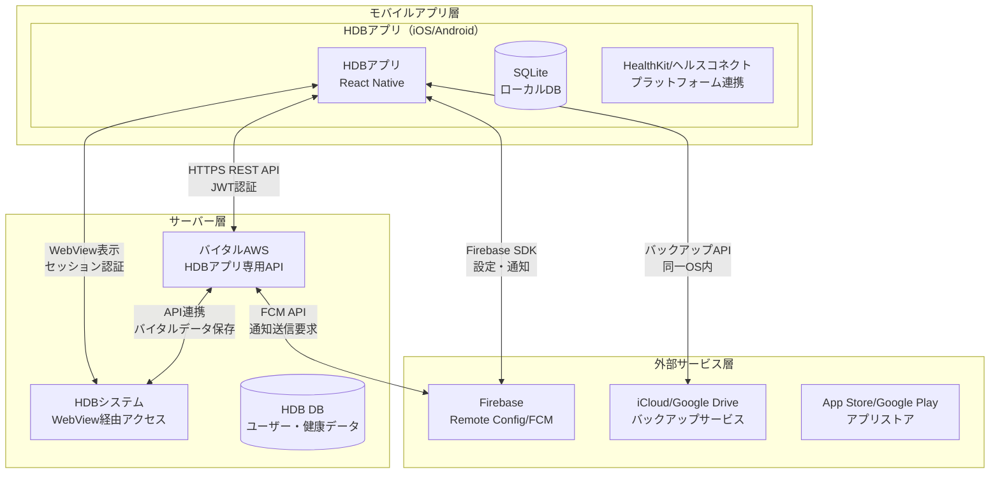
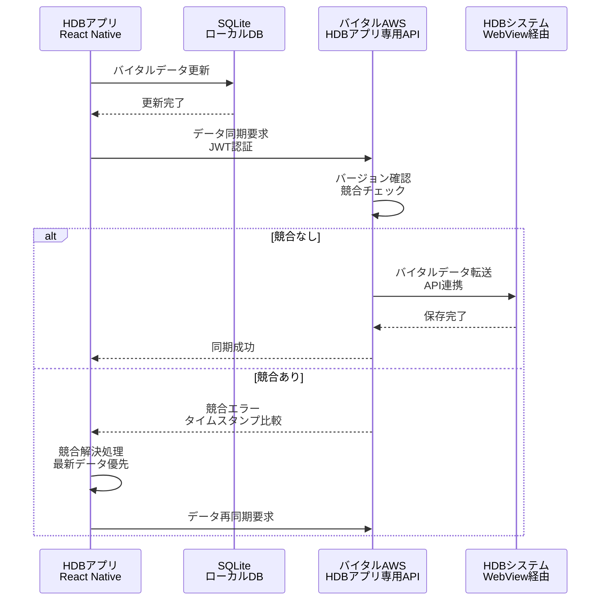
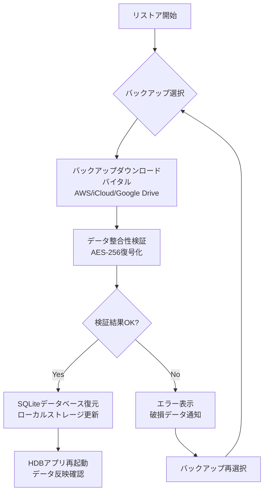
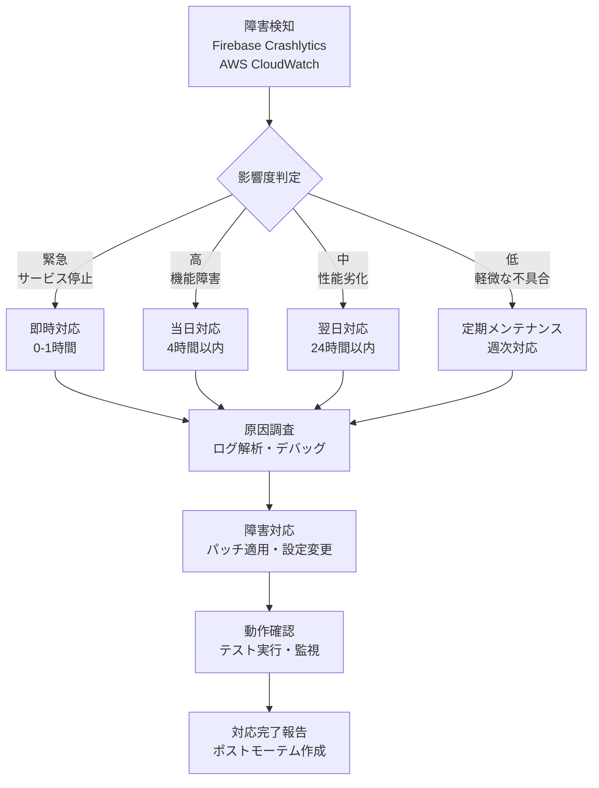

# 連携処理方式概要設計書

## 1. システム連携構成概要



## 2. 通信方式

### 2.1 アプリケーション間通信

#### 2.1.1 HDBアプリ ⇔ バイタルAWS API

| 項目 | 仕様 |
|---|---|
| プロトコル | HTTPS (TLS 1.2以上) |
| 通信方式 | REST API |
| データ形式 | JSON |
| 認証方式 | JWT (JSON Web Token) |
| タイムアウト | 30秒 |
| リトライ | 最大3回（指数バックオフ） |

**主要API**
- ユーザー認証: POST /api/auth/login
- バイタルデータ同期: POST /api/vitals/sync
- バックアップ: POST /api/backup/upload
- リストア: GET /api/backup/download

#### 2.1.2 HDBアプリ ⇔ HDBシステム

| 項目 | 仕様 |
|---|---|
| プロトコル | HTTPS |
| 通信方式 | WebView経由 |
| 認証方式 | セッションベース認証 |
| Cookie管理 | WebView内で自動管理 |

#### 2.1.3 HDBアプリ ⇔ Firebase

| 項目 | 仕様 |
|---|---|
| プロトコル | HTTPS |
| 通信方式 | Firebase SDK |
| 認証方式 | Firebase App ID |
| プッシュ通知 | FCM (Firebase Cloud Messaging) |
| 設定配信 | Remote Config |

### 2.2 サーバー間通信

#### 2.2.1 バイタルAWS ⇔ HDBシステム

| 項目 | 仕様 |
|---|---|
| プロトコル | HTTPS |
| 通信方式 | REST API |
| 認証方式 | API Key + IP制限 |
| データ形式 | JSON/CSV |

### 2.3 プラットフォーム連携

#### 2.3.1 HealthKit連携（iOS）

| 項目 | 仕様 |
|---|---|
| SDK | HealthKit Framework |
| データ取得 | バックグラウンド更新 |
| 権限管理 | ユーザー許可制 |
| 同期頻度 | 1日1回（深夜2時） |

#### 2.3.2 ヘルスコネクト連携（Android）

| 項目 | 仕様 |
|---|---|
| SDK | Health Connect API |
| データ取得 | バックグラウンド更新 |
| 権限管理 | ユーザー許可制 |
| 同期頻度 | 1日1回（深夜2時） |

## 3. トランザクション管理方式

### 3.1 トランザクション制御

#### 3.1.1 ローカルトランザクション

| 処理 | 方式 |
|---|---|
| SQLite操作 | BEGIN/COMMIT/ROLLBACK |
| 分離レベル | SERIALIZABLE |
| ロック方式 | 排他制御（WALモード） |

#### 3.1.2 分散トランザクション

| 処理 | 方式 |
|---|---|
| データ同期 | 楽観的ロック（バージョン管理） |
| 競合解決 | タイムスタンプベース |
| 整合性保証 | 結果整合性 |

### 3.2 データ同期管理



## 4. リカバリ方式

### 4.1 障害レベル定義

| レベル | 内容 | 対応方式 |
|---|---|---|
| L1 | ネットワーク一時障害 | 自動リトライ |
| L2 | アプリケーションエラー | エラーハンドリング・再起動 |
| L3 | データ不整合 | データ再同期 |
| L4 | システム障害 | バックアップからのリストア |

### 4.2 リカバリ処理

#### 4.2.1 自動リカバリ

| 障害種別 | リカバリ方式 |
|---|---|
| 通信タイムアウト | 指数バックオフによる自動リトライ（最大3回） |
| 認証エラー | トークン自動更新 |
| 一時的なDB障害 | トランザクションロールバック・再実行 |

#### 4.2.2 手動リカバリ

| 障害種別 | リカバリ方式 |
|---|---|
| データ消失 | バックアップからのリストア画面提供 |
| アカウント障害 | 再ログイン画面への誘導 |
| システム更新必要 | アプリ更新画面への誘導 |

### 4.3 バックアップ・リストア

#### 4.3.1 自動バックアップ

| 項目 | 仕様 |
|---|---|
| 頻度 | 1日1回（深夜3時） |
| 保存先 | バイタルAWS / iCloud / Google Drive |
| 保持期間 | 30日間 |
| 暗号化 | AES-256 |

#### 4.3.2 リストア処理



## 5. 異常処理方式

### 5.1 エラー分類

| 分類 | 内容 | 処理方式 |
|---|---|---|
| システムエラー | アプリ内部エラー | エラーログ記録・クラッシュレポート送信 |
| 通信エラー | ネットワーク障害 | リトライ・オフライン処理 |
| 業務エラー | 入力値不正など | ユーザーへのエラーメッセージ表示 |
| 外部サービスエラー | 連携先障害 | 代替処理・縮退運転 |

### 5.2 エラーハンドリング

#### 5.2.1 エラー処理フロー

```typescript
// エラー処理の基本パターン
try {
    // 通常処理
    const result = await apiCall();
    return result;
} catch (error) {
    // エラー分類
    if (isNetworkError(error)) {
        // リトライ処理
        return await retryWithBackoff(apiCall);
    } else if (isAuthError(error)) {
        // 認証更新
        await refreshAuth();
        return await apiCall();
    } else if (isBusinessError(error)) {
        // ユーザー通知
        showErrorMessage(error.message);
    } else {
        // システムエラー
        logError(error);
        showGenericError();
    }
}
```

#### 5.2.2 エラー通知

| 対象 | 通知方法 |
|---|---|
| ユーザー | アプリ内メッセージ・ダイアログ |
| 開発者 | クラッシュレポート（Firebase Crashlytics） |
| 運用者 | ログ集約・監視アラート |

### 5.3 オフライン処理

| 機能 | オフライン時動作 |
|---|---|
| データ入力 | ローカル保存・後で同期 |
| データ参照 | キャッシュデータ表示 |
| 認証 | キャッシュトークンで動作継続 |
| 通知 | ローカル通知のみ動作 |

## 6. システム基盤制御ツール

### 6.1 監視ツール

| ツール | 用途 | 監視項目 |
|---|---|---|
| Firebase Analytics | アプリ利用状況 | DAU、画面遷移、イベント |
| Firebase Crashlytics | クラッシュ監視 | クラッシュ率、エラー発生状況 |
| AWS CloudWatch | API監視 | レスポンスタイム、エラー率 |
| Firebase Performance | パフォーマンス監視 | 起動時間、API応答時間 |

### 6.2 ログ管理

#### 6.2.1 ログレベル

| レベル | 内容 | 出力先 |
|---|---|---|
| DEBUG | デバッグ情報 | 開発環境のみ |
| INFO | 一般情報 | ローカルファイル |
| WARN | 警告 | ローカル + リモート |
| ERROR | エラー | ローカル + リモート + アラート |

#### 6.2.2 ログローテーション

| 項目 | 仕様 |
|---|---|
| ローカル保持期間 | 7日間 |
| 最大サイズ | 10MB |
| ローテーション方式 | 日次 |

### 6.3 デプロイメント管理

| 環境 | ツール | 用途 |
|---|---|---|
| 開発 | React Native CLI | ローカルビルド・デバッグ |
| ステージング | TestFlight / Google Play Console | ベータテスト配信 |
| 本番 | App Store Connect / Google Play Console | 本番リリース |
| OTA更新 | CodePush（検討中） | 緊急パッチ配信 |

## 7. 運用作業支援ツール

### 7.1 運用管理ツール

| ツール | 機能 | 用途 |
|---|---|---|
| Firebase Console | 全体管理 | ユーザー管理、設定変更、通知送信 |
| AWS Console | インフラ管理 | API管理、データベース管理 |
| Remote Config | 設定管理 | 動的設定変更 |
| FCM Console | 通知管理 | プッシュ通知送信 |

### 7.2 運用手順

#### 7.2.1 定期メンテナンス

| 作業 | 頻度 | 内容 |
|---|---|---|
| ログ確認 | 日次 | エラーログ・異常動作確認 |
| バックアップ確認 | 週次 | バックアップ正常性確認 |
| パフォーマンス確認 | 月次 | レスポンスタイム分析 |
| セキュリティ更新 | 随時 | ライブラリ・SDK更新 |

#### 7.2.2 障害対応



### 7.3 サポートツール

| ツール | 用途 |
|---|---|
| リモートデバッグ | Chrome DevTools（React Native） |
| ログビューア | Flipper |
| APIテスト | Postman |
| 負荷テスト | JMeter |

## 8. セキュリティ考慮事項

### 8.1 通信セキュリティ

| 項目 | 対策 |
|---|---|
| 暗号化 | TLS 1.2以上必須 |
| 証明書検証 | Certificate Pinning実装 |
| API認証 | JWT + リフレッシュトークン |
| データ暗号化 | AES-256（保存時） |

### 8.2 データ保護

| 項目 | 対策 |
|---|---|
| 個人情報 | 暗号化保存 |
| 認証情報 | Keychain/Keystore使用 |
| 通信ログ | 個人情報マスキング |
| バックアップ | 暗号化必須 |

## 9. パフォーマンス要件

### 9.1 レスポンスタイム目標

| 処理 | 目標値 |
|---|---|
| アプリ起動 | 3秒以内 |
| 画面遷移 | 1秒以内 |
| API応答 | 2秒以内 |
| データ同期 | 10秒以内 |

### 9.2 可用性目標

| 項目 | 目標値 |
|---|---|
| サービス稼働率 | 99.5% |
| 計画停止 | 月1回以内 |
| MTTR | 4時間以内 |

## 10. 拡張性考慮事項

### 10.1 スケーラビリティ

| 項目 | 対応方針 |
|---|---|
| ユーザー数増加 | API自動スケーリング |
| データ量増加 | データベース分割 |
| 通信量増加 | CDN活用 |

### 10.2 将来拡張

| 機能 | 考慮事項 |
|---|---|
| 新規プラットフォーム | プラグイン形式で追加可能 |
| 新規連携先 | アダプターパターンで実装 |
| 新規データ形式 | 変換処理の抽象化 |

## 11. 検証項目

### 11.1 機能検証

- [ ] 各API通信の正常動作確認
- [ ] エラー処理の動作確認
- [ ] オフライン時の動作確認
- [ ] データ同期の整合性確認
- [ ] バックアップ・リストア動作確認

### 11.2 性能検証

- [ ] レスポンスタイム測定
- [ ] 同時接続数テスト
- [ ] データ量増加時の性能確認
- [ ] ネットワーク品質劣化時の動作確認

### 11.3 セキュリティ検証

- [ ] 通信暗号化確認
- [ ] 認証機能の脆弱性診断
- [ ] データ保護状態確認
- [ ] ペネトレーションテスト

## 12. 付録

### 12.1 用語集

| 用語 | 説明 |
|---|---|
| HDB | Health Data Bank（健康データバンク） |
| JWT | JSON Web Token（認証トークン形式） |
| FCM | Firebase Cloud Messaging（プッシュ通知サービス） |
| WAL | Write-Ahead Logging（SQLiteのジャーナリングモード） |
| MTTR | Mean Time To Repair（平均修復時間） |

### 12.2 参照資料

- HDBアプリケーション実装方式書
- セキュリティ方式概要設計書
- 全体システム構成図
- API仕様書
- データベース設計書

## 13. ドキュメント情報

| 項目 | 内容 |
|---|---|
| ドキュメント名 | 連携処理方式概要設計書 |
| バージョン | 1.0 |
| 作成日 | 2025-08-21 |
| 対象システム | HDBアプリケーション |